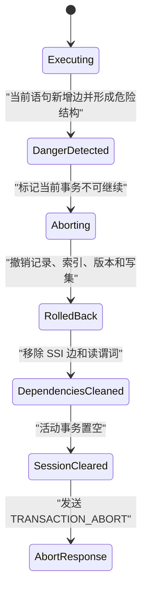
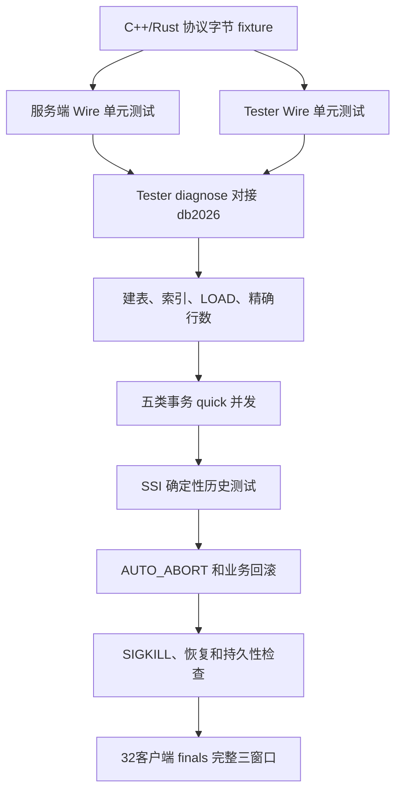
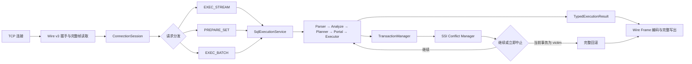
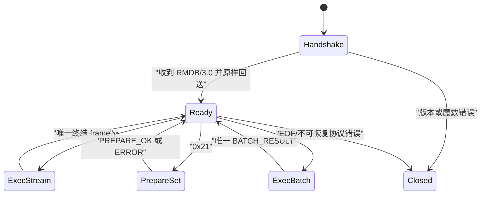

SSI 固定 victim 与立即中止
1. 依赖图模型
每个 SERIALIZABLE 事务维护：
SsiTxnEntry
├─ txn_id
├─ start_ts
├─ commit_ts
├─ ACTIVE / COMMITTED / ABORTING / ABORTED
├─ record_reads
├─ predicate_reads
├─ incoming_rw
└─ outgoing_rw
rw 反依赖方向固定为：
读取旧版本的事务 → 写入新版本的事务
reader --rw--> writer
只有两个事务均为 SERIALIZABLE、事务生命周期重叠且尚未安全回收时，才能建立依赖。Snapshot Isolation 排名事务不维护 SSI 图，避免给正式排名路径增加无意义开销。
2. 事务重叠判定
两个事务重叠，当且仅当：
left 尚未提交或 left.commit_ts > right.start_ts
并且
right 尚未提交或 right.commit_ts > left.start_ts
已经在另一个事务开始前提交的事务，不能与其形成 rw 反依赖。
3. rw 反依赖产生位置
当前语句是 SELECT
SELECT 在以下情况下建立：
当前读取事务 → 修改该记录或谓词范围的并发事务
必须覆盖：
精确记录读；
索引点查；
索引范围读；
顺序扫描；
返回多行的谓词读；
返回0行的空范围读。
谓词必须在扫描开始前注册，不能等到读取第一行才注册，否则空结果查询无法阻止后续 phantom 写入形成的异常。
当前语句是 INSERT
INSERT 的新记录如果落入其他并发事务已经读取的谓词范围：
已有谓词读取事务 → 当前 INSERT 事务
当前语句是 UPDATE
UPDATE 同时具有读取和写入语义：
WHERE 谓词必须注册为读取；
实际命中的记录必须注册为记录读；
更新前或更新后任一版本匹配其他事务的谓词，都产生“其他读事务 → 当前写事务”。
当前语句是 DELETE
DELETE 同样必须记录 WHERE 谓词。被删除前的版本匹配其他事务谓词时：
其他读取事务 → 当前 DELETE 事务
当前代码中 UPDATE/DELETE 构造扫描器时关闭了 track_serializable_reads，这会漏掉谓词读和记录读，必须修正。
4. 危险结构判定
采用当前代码已经接近的标准 SSI 结构：
T_in --rw--> T_pivot --rw--> T_out
新增边必须是上述两条边之一，并满足相邻事务确实重叠。
确定形成危险结构的条件为：
T_in == T_out
即两事务写偏序环；或者：
T_out 已提交
并且
T_in 尚未提交
或 T_out.commit_ts < T_in.commit_ts
即三事务结构中 T_out 先于 T_in 提交。
依赖插入与危险结构检查必须在同一个 mvcc_latch_ 临界区内完成，避免两个并发语句各自只看到半张图。SSI 管理器是逻辑独立组件，但初版继续复用现有 MVCC 叶子锁，不额外引入复杂锁序。
5. victim 规则
危险结构由哪条语句闭合，就中止执行该语句的事务。
例如：
T1 读取 A
T2 读取 B
T1 更新 B
T2 更新 A  ← 该 UPDATE 新增第二条边并闭环
必须：
T2 是 victim；
T2 的 UPDATE 立即返回事务中止；
不能改为中止 T1；
不能让 T2 的 UPDATE 返回成功后，到 T2 COMMIT 才中止；
不能因为“中止T1也能恢复串行化”而选择T1。
同样，如果闭合危险结构的是当前 SELECT，则中止执行 SELECT 的事务，而不是已有 writer。
因此危险结构接口必须显式接收：
check_new_edge(reader, writer, current_statement_txn)
不能让 SSI 管理器自行选择“最年轻事务”“代价最小事务”或 pivot。
6. 写入前置检查
当前实现先安装 pending version，再检查 SSI。设计调整为：
计算 prospective before/after version
→ 检查写写冲突
→ 查找受影响的 record/predicate reader
→ 原子加入 rw 边并检查危险结构
→ 若安全，才安装 pending version
→ 执行表和索引修改
这样触发 SSI 中止的当前写操作不会先把新的 pending version 暴露给内部结构。
事务之前已经执行的其他写入仍必须通过整笔事务回滚清除。
7. 立即中止状态机

严格顺序为：
在依赖图中判定当前事务为 victim；
将事务状态改为 ABORTING，阻止其他线程等待后继续使用它；
释放 mvcc_latch_；
调用统一事务回滚入口；
撤销表记录和全部索引变化；
删除该事务 pending version；
清理写集、锁、谓词、记录读和依赖边；
状态变为 ABORTED；
从会话移除当前事务；
最后构造协议响应。
禁止只调用当前的 mark_mvcc_txn_aborted() 就直接回包。该函数目前只设置标志，不代表完整回滚已经完成。
8. 协议映射
执行入口	SSI 中止响应
EXEC_STREAM	单个 TRANSACTION_ABORT frame
EXEC_BATCH	BATCH_RESULT status=1
batch 部分查询结果	全部丢弃
executed_operations	失败语句之前完成尝试的数量
failed_operation	当前触发危险结构的 operation
后续客户端动作	直接重试，不发送第二次 ABORT

COMMIT 不再作为 SSI 危险结构的延迟裁决点。COMMIT 仍可处理持久化失败等其他错误，但不能把本应在 SELECT/INSERT/UPDATE/DELETE 发现的 SSI 冲突拖到提交阶段。
9. 依赖生命周期
已提交事务的 SSI 元数据不能在 COMMIT 后立即删除，因为仍在运行的旧快照可能与它形成危险结构。
回收条件：
committed 事务：commit_ts <= 当前最老活动 SERIALIZABLE 事务的 start_ts；
aborted 事务：完整回滚且所有依赖边已经清除；
未来事务不可能与其重叠后，才能删除元数据。
依赖清理后必须同时更新边的两端，不能留下只存在于一侧的悬挂边。
10. 性能约束
当前实现会遍历全部事务和大量版本。重构后维护：
record_key → reader txn set；
table_id → predicate readers；
事务自身的反向清理索引；
去重后的 rw edge；
按 SSI watermark 回收的提交事务。
写入只检查同一记录和同一表的相关读者。所有索引只服务通用事务语义，不包含 TPC-C 表名或 statement_id 特判。
11. 确定性测试矩阵
SER 测试至少覆盖：
两事务 record write skew；
两事务 predicate write skew；
空范围 SELECT 与后续 INSERT；
UPDATE 使记录进入谓词范围；
UPDATE 使记录离开谓词范围；
DELETE 命中已读谓词；
当前 SELECT 闭合危险结构；
当前 INSERT/UPDATE/DELETE 分别闭合危险结构；
三事务结构中 T_out 先提交；
不满足提交顺序的安全结构；
不重叠事务不建立边；
SI 连接不进入 SSI 图；
abort 后依赖清理；
commit 后依赖保留到 watermark；
顺序扫描与索引扫描得到相同判定；
victim 回滚后同一连接可以重新 BEGIN；
失败语句返回时数据库中不存在 victim 的部分修改；
EXEC_BATCH 失败不返回此前 query 结果。
每个历史记录：
Isolation level
Scenario
Session
Scenario step
Operation
Expected terminal
Observed terminal
Expected victim
Rollback verification

双仓库交叉验证
1. TPCC-Tester 的定位
当前 Tester 可以继续复用：
九表数据生成与 CSV 装载框架；
五类事务的业务流程；
Tokio 多连接执行框架；
基础诊断、统计和报告能力；
部分一致性查询。
必须重写：
文本 TCP 客户端；
? 参数文本替换；
文本表格结果解析；
固定事务数执行方式；
无限重试；
简化的仓库随机策略；
4项近似一致性检查。
最终不保留 legacy | v3 切换和 cursor_compat。
2. Tester 目标结构
TPCC-Tester
├─ protocol/       Wire v3、typed cell、Stream/Prepare/Batch
├─ sql/            prepared 模板、statement_id、参数/schema 定义
├─ workload/       160槽轮盘、热点、事务比例、窗口
├─ txn/            五类事务的 batch 阶段
├─ engine/         32连接、重试、窗口控制
├─ check/          装载、在线、恢复后检查
├─ report/         NewOrder/min、p50/p99、abort 分类
└─ diagnose/       协议、SQL、隔离、AUTO_ABORT 探针
Tester 的协议实现与服务端实现独立编写，通过相同字节 fixture 交叉校验，避免“客户端和服务端犯同一个错误后互相通过”。
3. 现有功能的迁移方式
现有功能	迁移后用途
--diagnose	通过 Wire EXEC_STREAM 检查测活、CRUD、事务、聚合、隔离设置
--init	通过 Wire 创建9表、10索引、执行9次 LOAD
--stats	读取类型化 COUNT 结果
--check	扩展为精确行数、关系、FLOAT32 和事务账本检查
--benchmark	通过 SI + PREPARE_SET + EXEC_BATCH 执行正式负载
五类事务源码	提取业务步骤，改写为 prepared operation 和依赖 batch
Tokio worker	固定32个排名连接，每连接独立会话和 prepared 字典

当前 checker.rs 中以下假设必须删除：
order_line = orders × 10；
d_next_o_id - 1 == MAX(no_o_id) 始终成立；
Delivery 后 new_orders 必须无空洞；
只根据现存数据库值做自引用检查。
它们可能在合法的动态明细和 Delivery 执行后产生误判。新的 checker 必须依赖数据生成账本和成功事务账本。
4. 两套运行配置
保留两个配置档，但协议和事务语义完全相同：
quick：缩短窗口、缩小仓库数，用于开发回归；
finals：50仓库、32客户端、一次30秒预热、连续3×150秒、45/43/4/4/4、160槽轮盘和仓库覆盖门禁。
quick 只能缩小规模和时间，不能改成旧协议、文本参数或不同事务语义。
5. 交叉执行顺序

每个阶段失败就停止进入下一阶段，避免在基础正确性失败时继续测吞吐。
6. SSI 测试不依赖随机 TPC-C
SSI 的 victim 和中止时机需要确定性调度，因此单独建立多会话历史驱动器，控制：
每个连接的隔离级别；
BEGIN顺序；
SELECT/INSERT/UPDATE/DELETE交错点；
record、predicate、空范围读；
当前语句预期返回；
事务是否已经在返回前完成回滚；
中止后的数据、索引和依赖是否清理。
正式27个SER历史的隐藏 SQL 和完整调度没有公开，因此本地不能宣称与隐藏用例逐字相同；但会按公开场景族构造覆盖矩阵，严格验证题面公开的固定 victim 与立即中止契约。
7. 验收证据
最终交付不会只给一个 tpmC 数字，而是保存：
协议 fixture 结果；
diagnose 报告；
装载精确行数；
SSI 历史逐步终结状态；
AUTO_ABORT 前后数据对比；
三个窗口分别的 NewOrder/min；
成功、预期回滚、可重试中止、错误和放弃数量；
p50、p99；
在线一致性结果；
SIGKILL 后恢复结果；
WAL write 与稳定化时序证据；
三窗口中位数。
补充事实：TPCC-Tester-main 当前是无 .git 元数据的源码目录，因此后续可以作为测试资源修改和执行，但无法在该目录形成正常 Git 提交记录；主设计文档和数据库改动仍在 db2026 仓库审查。

设计第 1 节：总体架构与模块边界

1. rmdb.cpp 只负责启动和接入
重构后，rmdb.cpp 不再解析 SQL、不再拼接字符输出，也不直接决定事务错误如何响应。它只负责：
初始化存储、索引、事务、WAL、恢复和执行组件；
创建监听 socket；
接受连接；
为每个连接创建 ConnectionSession；
服务关闭时回收资源。
暂时保留“一连接一工作线程”，因为正式测评只有32个连接且每个连接只有一个 outstanding request。当前性能重点是减少 SQL 重复解析、网络往返和逐语句响应，不引入 epoll 重写风险。
2. 网络层成为独立模块
建议新增 src/network/，包含：
wire_protocol.h：tag、状态码、类型码和长度上限；
wire_codec.cpp：大端整数、typed cell、各种 payload 的编解码；
socket_io.cpp：read_exact、write_all，正确处理 EINTR、EOF 和 partial I/O；
connection_session.cpp：握手、请求状态机、事务归属和 prepared 字典；
request_dispatcher.cpp：分发三类请求并保证唯一终结响应。
任何网络输入在进入 SQL 层前都必须完成长度、tag、flags、reserved、type 和尾随字节校验。
3. 执行层不再生成文本
新增 SqlExecutionService 作为协议层与现有数据库流水线之间的唯一桥梁。执行结果统一表示为：
command 成功；
query schema；
类型化行；
transaction abort；
普通 error。
因此需要逐步移除：
Context::data_send_；
Context::offset_；
RecordPrinter 对网络输出缓冲区的依赖；
enable_output_file；
SET OUTPUT_FILE OFF/ON；
output.txt 写入逻辑。
EXEC_STREAM 可以边执行边向类型化结果 sink 推送行；EXEC_BATCH 使用不超过 1 MiB 的有界结果构造器，在全部操作成功后一次形成 BATCH_RESULT。
4. 会话状态严格隔离
每个 ConnectionSession 独立持有：
当前隔离级别；
当前事务及事务状态；
prepared statement 字典；
请求和响应缓冲区；
协议状态；
本连接诊断信息。
statement_id 只在当前连接内有效。连接之间可以共享不可变 parsed plan，但参数、事务、运行时算子和结果不能共享。
5. SSI 作为独立判定核心
现有 SSI 依赖记录散落在 TransactionManager 中。重构后由 SsiConflictManager 统一负责：
记录 record read、predicate read 和空范围读；
建立带方向的 rw 反依赖；
判断新增边是否闭合危险结构；
返回明确的 CONTINUE 或 ABORT_CURRENT_TRANSACTION。
它不自行选择 victim。只要当前语句新增的依赖触发危险结构，调用方必须中止当前事务，并在向客户端返回前完成表、索引、MVCC pending version、写集和依赖图的清理。
6. 明确不做的事情
本次不引入：
同一连接请求流水线；
请求乱序响应；
多路复用；
TPC-C 表名或 SQL 模板硬编码；
同端口旧协议识别；
为跑分绕过 Parser、Planner、Executor、WAL 或 SSI 的特殊执行路径。
这一总体架构是否确认？

星期四17:14

确认，前提满足决赛性能框架测试要求即可

星期四17:18

已处理 1m 25s

设计第 2 节：Wire v3 状态机与排名执行路径
1. 连接状态机

TCP 建立后必须先完整读取8字节握手：
前4字节必须为 RMDB；
major 为3；
minor 为0；
多字节整数全部使用大端序；
成功后原样回送8字节；
握手不合法直接关闭，绝不送入 Parser。
握手完成后，每次先完整读取8字节 frame header，再按 payload_bytes 读取 payload。payload_bytes 最大1 MiB。
2. I/O 正确性
所有网络读写必须使用循环：
read_exact 处理 TCP 分片、短读、EINTR 和 EOF；
write_all 或等价的 writev/sendmsg 循环处理短写；
不允许假定一次 recv/send 完成一个 frame；
长度校验必须发生在内存分配之前；
请求缓冲和响应缓冲按连接复用，不能按 operation 无界增长。
遇到未知 tag、非法 flags、非零 reserved、非法类型、截断字段、尾随字节或超长 payload，返回合法 ERROR 后关闭连接，防止协议流失去边界。
3. EXEC_STREAM
请求 payload 是不含 NUL 的非空 UTF-8 SQL。
查询结果严格为：
META → ROW* → RESULT_END
其中：
META 只出现一次；
每个 ROW 按 schema 编码类型化 cell；
RESULT_END.row_count 必须等于已发送行数；
中途失败后不能再发送成功终结。
DDL、DML、LOAD、事务控制和隔离级别设置成功时，只返回空 payload 的 COMMAND_OK。
并发冲突或 SSI 判定主动中止事务时：
完整回滚当前事务；
清理写集、pending version、索引变化和 SSI 依赖；
结束会话中的活动事务；
返回 TRANSACTION_ABORT。
普通语法、语义或不可重试执行错误返回 ERROR。
4. PREPARE_SET
每个连接独立维护字典：
statement_id
→ result_kind
→ parameter types
→ parsed/analyzed template
→ 可复用逻辑计划
→ query schema
→ schema generation
安装过程分为两个阶段：
在临时字典中验证全部语句；
所有语句都成功后，原子替换旧字典。
必须检查：
语句数为1～256；
statement_id 非零且连接内唯一；
$1...$n 稠密且与声明参数数一致；
参数类型只能是 INT32、FLOAT32、CHAR；
command 的列数为0；
query 的列数、顺序和类型与真实投影完全一致；
payload 必须全部消费，不允许尾随内容。
Prepared 对象只复用不可变结构。Executor、参数值、事务上下文和结果容器必须每次重新创建，不能跨事务共享运行状态。
5. Typed bind
EXEC_BATCH 不把参数拼回 SQL 文本，而是直接绑定到参数槽位：
INT32：有符号32位大端整数；
FLOAT32：原始 IEEE-754 binary32 位模式；
CHAR：长度加原始字节，不带 NUL 和定长 padding；
present=0 可以解析，但正式 TPC-C 不依赖 SQL NULL。
这要求 Parser/AST/表达式层增加参数占位节点，执行前将参数写入本次 execution binding，而不是重新解析 SQL。
6. EXEC_BATCH
服务器应先完整解码并验证整个 batch，再执行任何 operation。这样能避免前面已经产生写入后，才发现后面参数截断或类型错误。
执行阶段必须：
严格按 operation 编码顺序执行；
复用同一连接的活动事务；
command 不产生逐条 ACK；
query 结果暂存在不超过1 MiB的有界结果构造器；
成功时只返回一个 BATCH_RESULT(status=OK)；
任一 operation 失败时丢弃此前全部查询结果。
AUTO_ABORT 失败路径：
识别失败 operation
→ 回滚活动事务
→ 清理会话事务状态
→ 丢弃部分查询结果
→ 构造唯一 BATCH_RESULT
状态必须精确映射：
可重试事务冲突：TRANSACTION_ABORT；
解析、绑定、协议或不可恢复错误：ERROR；
executed_operations 只计算失败 operation 之前完成尝试的操作；
failed_operation == executed_operations；
失败响应的 result_count 必须为0。
7. COMMIT 响应边界
如果 batch 内包含 COMMIT，则该 operation 只有在以下条件满足后才算执行成功：
Commit WAL record 已写入
→ 覆盖该新写入的 fsync/fdatasync 等稳定化完成
→ 才允许形成成功 BATCH_RESULT
后续可实现 group commit，但每个成功响应都必须等待自己的 commit record 被可审计的同步覆盖。不能先返回响应，再依赖后台刷盘。
8. 删除旧路径
本次直接删除：
旧 NUL 结尾 SQL 网络协议；
单次 read/write 假设；
output.txt；
SET OUTPUT_FILE OFF/ON；
旧的字符表格网络结果；
旧客户端和测试脚本中的输出开关。
C++ 命令行客户端统一通过 EXEC_STREAM；Python 测试客户端同时支持 EXEC_STREAM、PREPARE_SET 和 EXEC_BATCH。
9. 决赛框架验收
网络子项目至少通过：
握手和版本拒绝测试；
header/payload 分片与短写测试；
1 MiB 边界测试；
META/ROW/RESULT_END 顺序及 row_count 测试；
PREPARE 原子替换与 schema 精确匹配；
typed INT32/FLOAT32/CHAR 位级测试；
batch operation 顺序测试；
AUTO_ABORT 无部分结果、无部分写入测试；
TRANSACTION_ABORT 后客户端不发送第二次 ABORT；
32连接并发与连接状态隔离；
prepared 排名路径中不再重复解析完整 SQL；
Wire show tables; 启动测活；
SIGKILL 后成功 COMMIT 数据仍可恢复。