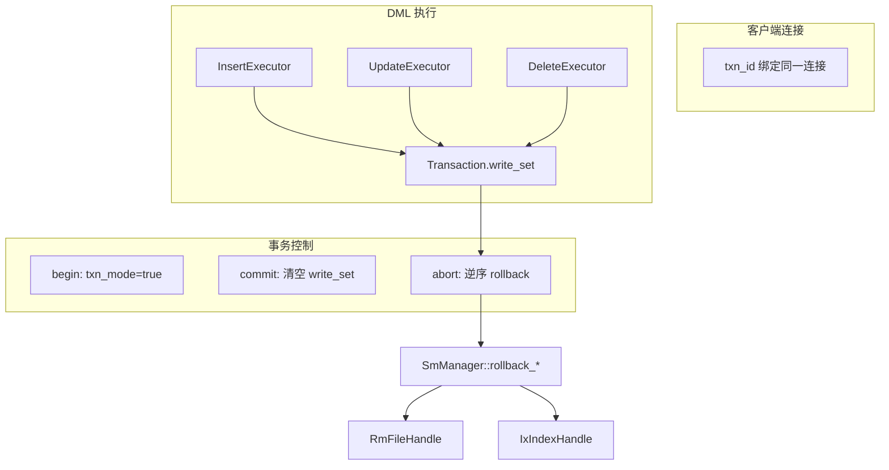

# 事务控制题解

## 一、题目要求摘要

在第二题（DDL / DML / DQL）基础上，实现**事务控制语句**：

| 语句 | 作用 |
|------|------|
| `begin;` | 显式开启事务 |
| `commit;` | 提交当前事务，保留事务内所有 DML 修改 |
| `abort;` | 回滚当前事务，撤销事务内所有 DML 修改 |

约束与说明：

- 显式事务内仅包含 **SELECT / INSERT / UPDATE / DELETE**，不含 DDL。
- 框架默认：**单条 SQL = 隐式事务**（执行完自动 `commit`）；`begin` 后进入显式模式，直到 `commit` 或 `abort`。
- **无并发事务**，无需实现完整 2PL / MVCC / 崩溃恢复（框架中相关接口可保持空实现）。
- 平台约 **4 个测点**：有/无索引下的提交与回滚；有索引场景可能含时间类型、TPC-C NewOrder 风格语句。

题面示例（abort 后应只剩初始行）：

```sql
create table student (id int, name char(8), score float);
insert into student values (1, 'xiaohong', 90.0);
begin;
insert into student values (2, 'xiaoming', 99.0);
delete from student where id = 2;
abort;
select * from student;
```

期待输出：

```text
| id | name | score |
| 1 | xiaohong | 90.000000 |
```

输出目录：`build/<数据库名>/output.txt`（如 `./bin/rmdb transaction_test_db`）。

---

## 二、总体思路

本题核心是 **写集（write_set）+ 逆序物理回滚**，不依赖 WAL 重做（题面无并发、无 crash 恢复要求）。



实现分层：

1. **执行层**：每次 INSERT / UPDATE / DELETE 向当前事务 `write_set` 追加 `WriteRecord`。
2. **系统层**：`SmManager::rollback_*` 按操作类型撤销表数据与索引。
3. **事务管理层**：`abort` 逆序遍历 `write_set` 并调用 `rollback`；`commit` 仅清空写集。
4. **会话层**（`rmdb.cpp`）：同一 TCP 连接内复用 `txn_id`；隐式 / 显式事务由 `txn_mode` 区分。

---

## 三、框架原有能力与缺口

### 3.1 已有（可直接复用）

| 模块 | 内容 |
|------|------|
| `src/transaction/transaction.h` | `Transaction`：`write_set_`、`lock_set_`、`txn_mode_`、状态机 |
| `src/transaction/txn_defs.h` | `WriteRecord`、`WType`、`TransactionState` |
| `src/parser/` | `TxnBegin` / `TxnCommit` / `TxnAbort` / `TxnRollback` AST |
| `src/optimizer/optimizer.h` | 映射为 `T_Transaction_*` 的 `OtherPlan` |
| `src/execution/execution_manager.cpp` | `run_cmd_utility` 处理 begin / commit / abort |
| `src/rmdb.cpp` | 每连接维护 `txn_id`；`txn_mode==false` 时语句结束自动 `commit` |

### 3.2 原缺口（本题需补齐）

| 缺口 | 后果 |
|------|------|
| DML 未写入 `write_set` | `abort` 无法知道要撤销什么 |
| `TransactionManager::abort` 仅改状态 | 表与索引数据不会被恢复 |
| 无 `SmManager::rollback` | 无法按类型撤销 INSERT / DELETE / UPDATE |
| 有索引时未维护索引回滚 | abort 后索引扫描仍能找到已“逻辑删除”的行 |

**未实现（本题可不做了）**：`LockManager` 真实加锁、`LogManager::add_log_to_buffer`、`RecoveryManager`、MVCC 版本链。

---

## 四、主要改动清单

### 4.1 写集记录（`executor_*.h`）

| 执行器 | 记录时机 | WriteRecord 内容 |
|--------|----------|------------------|
| `InsertExecutor` | `insert_record` 且索引 `insert_entry` 成功后 | `INSERT_TUPLE` + `tab_name` + `rid` |
| `DeleteExecutor` | 删行前保存 `old_rec` | `DELETE_TUPLE` + `tab_name` + `rid` + **整行旧值** |
| `UpdateExecutor` | 更新前保存 `old_rec` | `UPDATE_TUPLE` + `tab_name` + `rid` + **整行旧值** |

示例（Insert）：

```cpp
if (context_->txn_ != nullptr) {
    context_->txn_->append_write_record(new WriteRecord(WType::INSERT_TUPLE, tab_name_, rid_));
}
```

DELETE / UPDATE 必须在修改前 `RmRecord old_rec(*rec)`，否则 abort 无法恢复。

### 4.2 物理回滚（`src/system/sm_manager.cpp`）

| 函数 | abort 时行为 |
|------|----------------|
| `rollback_insert` | 读当前行 → 各索引 `delete_entry` → `delete_record` |
| `rollback_delete` | `insert_record(rid, old_data)` 恢复槽位 → 各索引 `insert_entry` |
| `rollback_update` | `update_record` 写回旧行；若索引键变化则 `insert_entry(old_key)` + `delete_entry(new_key)` |

索引键未变时跳过索引操作（`memcmp` 比较新旧键）。

### 4.3 事务管理（`src/transaction/transaction_manager.cpp`）

**`commit`**

1. 释放 `lock_set_`（当前 `LockManager` 为 stub，仍保持接口一致）
2. `clear_write_set`：删除各 `WriteRecord*` 指针，**不**调用 rollback
3. 状态 → `COMMITTED`

**`abort`**

1. 构造 `Context(lock_manager_, log_manager, txn)`
2. **从 `write_set` 尾部向前**弹出，对每条调用 `sm_manager_->rollback`
3. `delete` 对应 `WriteRecord`
4. 释放锁，状态 → `ABORTED`

逆序保证：同一行先 INSERT 再 DELETE 时，先撤销 DELETE（恢复行），再撤销 INSERT（删行）。

### 4.4 显式事务结束（`execution_manager.cpp`）

`commit` / `abort` / `rollback` 执行后增加：

```cpp
context->txn_->set_txn_mode(false);
```

避免显式事务结束后仍处于“不自动提交”模式，影响下一条隐式语句。

---

## 五、会话与事务生命周期

### 5.1 隐式事务（单条 SQL）

```
客户端发送一条 SQL
  → SetTransaction：若 txn 为空或已 COMMITTED/ABORTED，则 begin 新事务，txn_mode=false
  → 执行 DML，写入 write_set
  → 语句结束：txn_mode==false → commit（清空 write_set，状态 COMMITTED）
```

### 5.2 显式事务（begin … commit/abort）

```
begin;     → txn_mode=true，不自动 commit
insert;    → 同一 txn_id、同一 write_set
abort;     → 逆序 rollback，txn_mode=false
```

**关键**：`txn_id` 在 `client_handler` 循环内按**连接**保存：

```cpp
txn_id_t txn_id = INVALID_TXN_ID;  // 每个 TCP 连接一份
while (true) {
    SetTransaction(&txn_id, context);
    // ...
    if (context->txn_->get_txn_mode() == false)
        txn_manager->commit(...);
}
```

平台评测在同一连接上连续发多条 SQL；本地测试也须**复用同一 socket**，不能每条 SQL 新建连接。

### 5.3 SetTransaction 逻辑

```cpp
if (txn == nullptr || state == COMMITTED || state == ABORTED) {
    txn = begin(new);
    *txn_id = txn->get_transaction_id();
    txn->set_txn_mode(false);
}
```

显式 `begin` 仅将 `txn_mode` 置 `true`，不新建事务对象（在已有 GROWING 事务上继续）。

---

## 六、与索引（第三题）的协同

回滚必须**同时维护堆表与 B+ 树索引**，否则：

- abort 后 `select … where id = ?` 走 **IndexScan** 仍可能命中已插入的键；
- 或堆表已恢复但索引仍指向错误 RID。

| 操作 | 正向（执行） | 回滚（abort） |
|------|--------------|---------------|
| INSERT | 写表 + `insert_entry` | 删索引项 + `delete_record` |
| DELETE | 删索引 + `delete_record` | `insert_record(rid)` + `insert_entry` |
| UPDATE | 换索引键 + `update_record` | 恢复旧值 + 恢复旧索引键 |

第三题唯一索引约束在**事务内**仍生效；abort 后表与索引回到事务开始前状态。

---

## 七、本地测试

### 7.1 编译

```bash
cd /root/db2026/build
cmake .. -DCMAKE_BUILD_TYPE=Release
make -j4 rmdb
```

### 7.2 运行事务测试

```bash
python3 run_transaction_test.py
```

脚本路径：`build/run_transaction_test.py`。使用**持久连接** `Session` 发送多条 SQL。

| 用例 | 验证点 |
|------|--------|
| abort rolls back DML | 题面：insert + delete 后 abort，仅保留 id=1 |
| commit keeps DML | begin 内 insert，commit 后 select 两行 |
| abort with index | 有唯一索引时 abort，按 id 查不到 id=2 |
| abort update | update 后 abort，score 恢复 90.0 |

### 7.3 手动验证（题面示例）

```bash
cd /root/db2026/build
./bin/rmdb transaction_test_db
# 另开终端，用同一客户端工具连续发送 SQL（勿每条新建连接）
```

---

## 八、涉及文件一览

```
src/transaction/transaction_manager.cpp   # commit 清写集；abort 逆序 rollback
src/system/sm_manager.h                 # rollback 声明
src/system/sm_manager.cpp               # rollback_insert/delete/update
src/execution/executor_insert.h         # 写集：INSERT
src/execution/executor_delete.h         # 写集：DELETE + 旧行
src/execution/executor_update.h         # 写集：UPDATE + 旧行
src/execution/execution_manager.cpp     # commit/abort 后 txn_mode=false
build/run_transaction_test.py           # 本地 4 组事务测试
```

框架中**未改**但相关的文件：`transaction.h`、`txn_defs.h`、`rmdb.cpp`、`lock_manager.cpp`（stub）、`log_manager.cpp`（空实现）。

---

## 九、易错点与调试建议

1. **连接与 txn_id**  
   每条 SQL 新建 TCP 连接会导致每次都是新事务，`begin` / `abort` 无法跨语句生效。应用同一连接跑显式事务测试。

2. **DELETE / UPDATE 未保存旧行**  
   `WriteRecord` 对 DELETE/UPDATE 必须带完整 `RmRecord`，否则 `rollback_delete` / `rollback_update` 无法恢复。

3. **回滚顺序**  
   必须**从 write_set 栈顶（最后一条写操作）向前** rollback，否则 insert+delete 同一 rid 会乱序。

4. **索引未回滚**  
   仅有堆表回滚时，IndexScan 结果错误；务必在 `rollback_*` 中维护 `IxIndexHandle`。

5. **commit 与 abort 区别**  
   `commit` 只清空写集，**不**调用 rollback；`abort` 先 rollback 再清空。

6. **与 RMDB2025 的差异**  
   本题采用 **2PL 写集 + 物理撤销** 路径，未接 WAL / MVCC。RMDB2025 的 `InsertLogRecord`、`CLRLogRecord` 等可留作后续赛题扩展。

---

## 十、实现状态小结

| 能力 | 状态 |
|------|------|
| `begin` / `commit` / `abort` 解析与执行 | 已实现 |
| 隐式单语句自动提交 | 已实现（`rmdb.cpp`） |
| DML 写集 | 已实现 |
| abort 堆表 + 索引回滚 | 已实现 |
| 无索引 / 有索引提交与回滚 | 本地测试通过 |
| 并发 2PL、WAL 恢复、MVCC | 未实现（本题不要求） |
