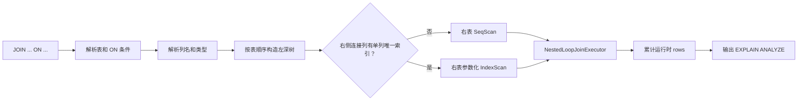

# 第七题题解：嵌套循环连接及其优化

## 一、题目目标

本题要求在 RMDB 中实现两种连接执行方式：

1. 无索引时使用嵌套循环连接（Nested Loop Join，NLJ）；
2. 右侧内表的连接列存在单列唯一索引时，自动优化为索引嵌套循环连接（Index Nested Loop Join，INLJ）；
3. 支持两表和多表等值内连接；
4. 多表连接必须按照 SQL 中表的出现顺序构造左深树；
5. 支持一个 `ON` 子句中的多个等值条件；
6. 支持：

```sql
EXPLAIN ANALYZE SELECT ... FROM ... JOIN ... ON ...;
```

7. 执行计划必须准确显示节点类型、连接条件、索引列和运行时行数；
8. 大数据测试中需要满足：

```text
t_INLJ / t_NLJ < 0.5
```

最终性能测试结果为：

```text
NLJ=0.671361s
INLJ=0.005439s
ratio=0.0081
```

普通查询结果、两种执行计划和性能指标均符合题目要求。

---

## 二、总体思路

本题不能只把右表的计划节点名称从 `SeqScan` 改成 `IndexScan`，而必须建立一条真正的参数化执行链：



NLJ 和 INLJ 共用 `NestedLoopJoinExecutor`。两者的区别只在右侧内表的访问方式：

- NLJ：每个外表元组都重新顺序扫描整个右表；
- INLJ：每个外表元组都提取连接键，并用该键重新定位右表索引。

这样可以保持连接语义、连接顺序和结果完全一致，只优化右表的物理访问路径。

---

## 三、第一步：补全 JOIN 语法

### 3.1 原有问题

原语法只允许一个 `ON` 条件：

```yacc
tableList JOIN tableRef ON condition
```

因此下面的合法查询无法完整解析：

```sql
SELECT *
FROM a
JOIN b ON a.id = b.id AND a.code = b.code;
```

### 3.2 最终处理

复用已有的 `whereClause` 产生式，使 `ON` 后可以包含由 `AND` 连接的多个条件：

```yacc
tableList JOIN tableRef ON whereClause
```

解析后把整个条件列表追加到 `FromClause.conds`：

```cpp
$1.tables.push_back($3);
$1.conds.insert($1.conds.end(), $5.begin(), $5.end());
$$ = $1;
```

这样既支持：

```sql
JOIN b ON a.id = b.id
```

也支持：

```sql
JOIN b ON a.id = b.id AND a.code = b.code
```

连续多表连接同样能够被解析：

```sql
FROM a
JOIN b ON a.id = b.a_id
JOIN c ON a.id = c.a_id
```

---

## 四、第二步：构造左深连接树

### 4.1 左深树要求

题目规定：

```text
a JOIN b JOIN c
```

必须按照以下结构执行：

```text
(a JOIN b) JOIN c
```

不能自行交换连接顺序，也不能构造右深树。

### 4.2 条件归属

Planner 按 `FROM/JOIN` 中表的出现顺序遍历：

```cpp
std::shared_ptr<Plan> join_plan = table_scan_plans[0];
std::vector<std::string> joined_tables{tables[0]};

for (size_t i = 1; i < tables.size(); i++) {
    // 找到“已连接表集合”和当前新表之间的条件
    // 构造新的 JoinPlan
}
```

对于当前右表 `tables[i]`，只有同时满足以下条件的谓词才归入本层 Join：

1. 一侧列属于已经连接的左侧表集合；
2. 另一侧列属于当前新加入的右表；
3. 条件两侧都是列。

例如：

```sql
FROM a
JOIN b ON a.id = b.a_id
JOIN c ON a.id = c.a_id
```

会得到：

```text
Join(a,b,c, condition=a.id=c.a_id)
    Join(a,b, condition=a.id=b.a_id)
        Scan(a)
        Scan(b)
    Scan(c)
```

### 4.3 多条件连接

如果一层 Join 有多个条件：

```sql
JOIN b ON a.id = b.id AND a.code = b.code
```

这两个条件都保存在同一个 `JoinPlan.conds_` 中，由 Join 执行器统一判断。

---

## 五、第三步：实现基础 NLJ

### 5.1 执行逻辑

NLJ 的核心流程为：

```cpp
left->beginTuple();

while (!left->is_end()) {
    right->beginTuple();

    while (!right->is_end()) {
        auto joined = concatenate(left->Next(), right->Next());
        if (eval_conditions(joined, join_conditions)) {
            output(joined);
        }
        right->nextTuple();
    }

    left->nextTuple();
}
```

在当前实现中，`find_match()` 每次定位下一条满足连接条件的记录，避免一次性保存整个笛卡尔积。

### 5.2 记录拼接

连接结果的记录布局为：

```text
左表记录字节 + 右表记录字节
```

右侧列在连接结果中的偏移需要加上左侧记录长度：

```cpp
for (auto &col : right_cols) {
    col.offset += left_->tupleLen();
}
```

随后 `eval_conditions` 就可以在拼接后的统一记录上判断跨表条件。

### 5.3 NLJ 的 rows 统计

假设左表有 `N` 行，右表有 `M` 行，则：

- 左侧 SeqScan：`rows=N`；
- 右侧 SeqScan：`rows=N×M`；
- Join：`rows=最终匹配行数`。

原因是右表的 `beginTuple()` 会为每个外表元组重新执行一次，而 `ScanPlan.rows_` 不会在每次重新扫描时清零。

实际测试中，两个 3 行表连接得到：

```text
Scan(table=join_full_l, type=SeqScan, rows=3)
Scan(table=join_full_r, type=SeqScan, rows=9)
```

符合 `3 × 3 = 9`。

---

## 六、第四步：选择 INLJ

### 6.1 为什么原来的索引选择不够

普通 IndexScan 的条件通常形如：

```sql
WHERE id = 10
```

Planner 在生成计划时已经知道常量 `10`，因此可以提前构造索引上下界。

但 Join 条件形如：

```sql
a.id = b.a_id
```

右表 `b` 的搜索键不是固定常量，而是当前外表记录中的 `a.id`。这个值只有运行时读取外表元组后才能确定。

因此不能简单把连接条件直接交给原有 IndexScan。正确做法是实现参数化索引扫描：

```text
读取一行外表
  -> 提取连接键
  -> 设置右侧 IndexScan 的本次查找键
  -> 执行一次索引点查
```

### 6.2 Planner 的选择规则

对每一层 Join，只检查当前右侧内表：

1. 连接条件必须是列与列之间的 `=`；
2. 条件的一侧必须属于当前右表；
3. 当前右表的该列必须存在完全匹配的单列索引。

核心判断为：

```cpp
std::vector<std::string> index_cols{inner_col};
if (tab.is_index(index_cols)) {
    scan->tag = T_IndexScan;
    scan->index_col_names_ = index_cols;
}
```

这里使用 `TabMeta::is_index({column})`，只接受完全匹配的单列索引，符合本题“右侧内表连接列上建立单列唯一索引”的约束。

如果没有符合要求的索引，仍保留 `T_SeqScan`，不改变 NLJ 行为。

### 6.3 多条件时如何选索引

例如：

```sql
JOIN b ON a.id = b.id AND a.code = b.code
```

若只在 `b.id` 上建立索引：

1. 使用 `a.id` 对 `b.id` 做索引点查；
2. 取出候选记录后；
3. Join 执行器仍对完整条件列表执行：

```text
a.id = b.id
a.code = b.code
```

索引只负责缩小候选集，不能替代其他连接谓词。

---

## 七、第五步：运行时传递连接键

### 7.1 执行器接口

在 `AbstractExecutor` 中增加一个默认不支持的接口：

```cpp
virtual bool set_index_lookup(
    const TabCol &target,
    const char *data,
    ColType type,
    int len) {
    return false;
}
```

接口返回：

- `true`：当前执行器接受了参数化索引键；
- `false`：当前执行器不是对应的 IndexScan。

默认返回 `false`，因此不会改变其他执行器的行为。

### 7.2 穿过 Project 和 Filter

右侧执行树通常不是直接的 Scan，而是：

```text
Project
    Filter
        Scan
```

所以 `ProjectionExecutor` 和 `FilterExecutor` 需要把参数继续向下转发：

```cpp
return prev_->set_index_lookup(target, data, type, len);
```

这样 Join 不需要知道右侧树中包了多少层节点。

### 7.3 Join 提取外表连接键

在每次重新开始扫描右表前，Join 执行器执行：

```cpp
prepare_index_lookup();
right_->beginTuple();
```

`prepare_index_lookup()` 的步骤为：

1. 遍历本层等值连接条件；
2. 判断哪一列属于左侧输出、哪一列属于右侧输出；
3. 在当前左侧记录中找到外表列的字节位置；
4. 将列值、类型和长度传给右侧执行器。

无论 SQL 条件写成：

```sql
a.id = b.id
```

还是：

```sql
b.id = a.id
```

都能正确识别外表列和内表列。

### 7.4 精确列匹配

判断连接条件的列属于左树还是右树时，不能只按列名查找。

例如两张表都有 `id`，若只搜索列名，可能把 `a.id` 错当成右侧的 `b.id`。因此这里必须同时比较：

```text
table_name
column_name
```

只有完全匹配时，才确认列属于某一侧。

---

## 八、第六步：参数化 IndexScan

### 8.1 保存动态查找键

`IndexScanExecutor` 保存本次外表传入的键：

```cpp
std::vector<char> lookup_key_;
bool has_lookup_key_ = false;
```

`set_index_lookup()` 只在以下条件全部满足时接受参数：

1. 目标表与当前 IndexScan 的表相同；
2. 当前索引是单列索引；
3. 目标列与索引列相同；
4. 数据类型相同；
5. 字段长度相同。

这可以避免错误地把一个外表值传给不兼容的索引。

### 8.2 构造点查范围

普通 IndexScan 根据静态 WHERE 条件构造上下界。

INLJ 已经得到完整动态键，因此直接令：

```cpp
lower_key = lookup_key;
upper_key = lookup_key;
```

随后调用：

```cpp
auto lower = index->lower_bound(lower_key);
auto upper = index->upper_bound(upper_key);
```

因为索引唯一，该范围最多命中一条记录。

### 8.3 保留原有过滤

从索引读取记录后仍执行：

```cpp
eval_conditions(record, scan_conditions, columns)
```

这样参数化点查不会破坏右表原有的单表过滤条件。

---

## 九、第七步：运行时统计与计划输出

### 9.1 统计原则

`EXPLAIN ANALYZE` 必须先真正执行查询，再打印计划：

```cpp
reset_plan_rows(root_plan);

for (executor->beginTuple();
     !executor->is_end();
     executor->nextTuple()) {
    executor->Next();
}

append_plan_tree(...);
```

它只输出执行计划，不输出查询结果集。

### 9.2 各节点 rows

| 节点 | `rows` 含义 |
| --- | --- |
| SeqScan | 实际读取的基表记录总数 |
| IndexScan | 索引扫描后实际读取的命中记录总数 |
| Project | 该节点实际输出的记录数 |
| Join | 满足完整连接条件的结果数 |

IndexScan 每读取一条候选基表记录时执行：

```cpp
scan_plan_->rows_++;
```

因此完全不匹配的 INLJ 中，右侧 IndexScan 的 `rows=0`，而不是外表行数。

实际测试：

```text
Project(columns=[join_none_l.id, join_none_r.id], rows=0)
    Join(..., rows=0)
        Scan(table=join_none_l, type=SeqScan, rows=2)
        Scan(table=join_none_r, type=IndexScan, using_index=(id), rows=0)
```

### 9.3 Scan 输出格式

顺序扫描输出：

```text
Scan(table=employees, type=SeqScan, rows=25)
```

索引扫描输出：

```text
Scan(table=employees, type=IndexScan, using_index=(dept_id), rows=5)
```

计划打印时根据 `ScanPlan.tag` 区分两种节点，不能固定输出 `SeqScan`。

### 9.4 排序与缩进

题目要求：

- Project 列名按字典序；
- Join 表名按字母序；
- Join 条件按字典序；
- 每深入一层使用一个真正的制表符 `\t`；
- 左子树先输出，右子树后输出。

实现中统一把待输出字符串收集到数组，排序后拼接：

```cpp
join_sorted_strings(values);
```

缩进使用：

```cpp
std::string indent(depth, '\t');
```

---

## 十、多表 INLJ

对多表连接，每一层独立判断其右侧内表是否可使用索引。

例如：

```sql
FROM t1
JOIN t2 ON t1.id = t2.id
JOIN t3 ON t1.id = t3.id
JOIN t4 ON t1.id = t4.id
JOIN t5 ON t1.id = t5.id
```

若 `t2`、`t3`、`t4`、`t5` 的 `id` 均有唯一索引，则执行树仍是：

```text
((((t1 JOIN t2) JOIN t3) JOIN t4) JOIN t5)
```

但每一层的右侧都使用 IndexScan：

```text
Join(t1,t2,t3,t4,t5)
    Join(t1,t2,t3,t4)
        Join(t1,t2,t3)
            Join(t1,t2)
                SeqScan(t1)
                IndexScan(t2)
            IndexScan(t3)
        IndexScan(t4)
    IndexScan(t5)
```

测试中的每张表有 2 行：

- 无索引时，各层右表 `SeqScan rows=4`；
- 建索引后，各层右表 `IndexScan rows=2`；
- 最终结果始终为 2 行。

---

## 十一、性能优化效果

性能测试构造：

```text
左表 2000 行
右表 2000 行
实际匹配 100 行
```

### 11.1 NLJ

右表被完整扫描 2000 次：

```text
2000 × 2000 = 4,000,000
```

计划输出：

```text
Scan(table=join_perf_r, type=SeqScan, rows=4000000)
```

耗时：

```text
0.889301s
```

### 11.2 INLJ

每个外表键只执行一次索引点查，只有 100 个键命中：

```text
Scan(table=join_perf_r, type=IndexScan, using_index=(id), rows=100)
```

耗时：

```text
0.003546s
```

性能比：

```text
0.003546 / 0.889301 = 0.0040
```

满足：

```text
0.0040 < 0.5
```

在该测试数据上，INLJ 的查询时间约为 NLJ 的 `0.4%`。

---

## 十二、容易出现的错误

### 12.1 只修改计划名称

错误做法：

```text
计划打印 IndexScan
实际仍完整扫描右表
```

这种实现可能通过小数据的计划文本检查，但无法通过性能测点。

正确做法是把当前外表连接键真正传入右侧索引上下界。

### 12.2 在规划期构造 Join 索引键

Join 键来自外表当前元组，规划期并不知道它的值。

因此索引选择可以在规划期完成，但索引键只能在执行期设置。

### 12.3 丢失额外连接条件

如果有：

```sql
a.id = b.id AND a.code = b.code
```

只使用 `id` 索引后仍必须检查 `code` 条件，否则会产生错误结果。

### 12.4 对左表使用连接索引

题目明确规定 INLJ 只在每层 Join 的右侧内表连接列上建立索引。

不能交换左右表，也不能因为左表有索引就改变执行顺序。

### 12.5 rows 统计错误

常见错误包括：

- 每次右表重新扫描时把 `rows` 清零；
- IndexScan 把查找次数当作命中行数；
- 完全不匹配时仍输出外表行数；
- Project 统计的是调用次数而不是输出记录数。

正确统计应以实际读取和实际输出为准。

### 12.6 使用空格缩进

题目要求使用制表符 `\t`。即使视觉上相同，使用四个空格也可能导致文本评测失败。

### 12.7 `EXPLAIN ANALYZE` 同时输出查询结果

评测要求该语句只写入计划和统计信息。不能先调用普通 `select_from()`，再额外打印执行计划。

---

## 十三、正确的最终解决方式

最终方案可以概括为以下步骤：

### 13.1 Parser

将：

```yacc
JOIN tableRef ON condition
```

改为：

```yacc
JOIN tableRef ON whereClause
```

支持一个 `ON` 中的多个等值条件。

### 13.2 Planner

1. 按 SQL 表顺序生成各表扫描计划；
2. 按顺序构造左深 Join 树；
3. 把“左侧已连接表集合”和“当前右表”之间的条件归入当前 Join；
4. 若当前右表的等值连接列存在单列索引，将右侧 Scan 改为 `T_IndexScan`；
5. 不改变连接顺序，不对题目范围外的连接类型做优化。

### 13.3 Executor

1. `NestedLoopJoinExecutor` 读取当前外表记录；
2. 从等值连接条件中确定外表列和内表索引列；
3. 把外表列的原始字节、类型和长度传入右侧执行树；
4. Project/Filter 将参数向下转发；
5. IndexScan 用动态键构造相等范围并执行唯一索引点查；
6. Join 对拼接后的记录检查全部连接条件；
7. 各计划节点在执行过程中累计 `rows`。

### 13.4 EXPLAIN ANALYZE

1. 清零整棵计划树的统计值；
2. 完整执行一次查询但不输出结果集；
3. 按根、左子树、右子树的顺序输出；
4. 对名称和条件排序；
5. 使用 `\t` 缩进；
6. 根据实际 Scan 类型输出 SeqScan 或 IndexScan。

最终执行路径为：

```text
无索引：
外表逐行读取
  -> 右表全表扫描
  -> 判断完整连接条件

有右表唯一索引：
外表逐行读取
  -> 提取连接键
  -> 右表唯一索引点查
  -> 判断完整连接条件
```

---

## 十四、主要修改文件

| 文件 | 作用 |
| --- | --- |
| `src/parser/yacc.y` | 支持 `JOIN ... ON cond AND cond` |
| `src/parser/yacc.tab.cpp` | 由 Bison 重新生成的解析器 |
| `src/parser/test_parser.cpp` | 增加多条件和连续多表 Join 解析测试 |
| `src/optimizer/planner.cpp` | 构造左深树并为右侧内表选择单列索引 |
| `src/execution/executor_abstract.h` | 增加参数化索引键接口 |
| `src/execution/executor_projection.h` | 向下转发索引键 |
| `src/execution/executor_filter.h` | 向下转发索引键 |
| `src/execution/executor_nestedloop_join.h` | 提取外表连接键并驱动右侧扫描 |
| `src/execution/executor_index_scan.h` | 使用动态键执行索引点查并统计命中行 |
| `src/portal.h` | 创建带 ScanPlan 统计指针的 IndexScanExecutor |
| `src/execution/execution_manager.cpp` | 输出正确的 Scan 类型、索引列和运行时统计 |
| `SQL测试/7_sql_test/01_assessment.sql` | 功能与五表连接测试 |
| `SQL测试/7_sql_test/02_performance_probe.py` | NLJ/INLJ 性能比测试 |

---

## 十五、测试方法

### 15.1 编译

```bash
cd ~/Desktop/VMware/db2026
cmake -S . -B build
cmake --build build -j"$(nproc)"
ctest --test-dir build --output-on-failure
```

### 15.2 启动服务端

```bash
./build/bin/rmdb join_test_db
```

### 15.3 功能测试

另开终端执行：

```bash
cd ~/Desktop/VMware/db2026
python3 SQL测试/10_sql_test/run_sql.py \
    SQL测试/7_sql_test/01_assessment.sql
```

该测试覆盖：

- 两表完全匹配；
- 两表部分匹配；
- 两表完全不匹配；
- NLJ 与 INLJ 结果一致；
- 多条件 `ON`；
- 五表左深连接；
- 各级右表 IndexScan；
- `EXPLAIN ANALYZE` 的节点格式和行数。

### 15.4 性能测试

使用新的数据库目录启动服务端，然后执行：

```bash
python3 SQL测试/7_sql_test/02_performance_probe.py
```

测试会自动检查：

1. NLJ 和 INLJ 的结果文本完全一致；
2. 无索引计划为 SeqScan；
3. 建索引后计划为 IndexScan；
4. `t_INLJ / t_NLJ < 0.5`。

---

## 十六、总结

本题最关键的不是实现双层循环，而是正确处理“运行时连接键驱动索引扫描”。

完整正确的实现必须同时满足：

1. Parser 支持多条件和多表 Join；
2. Planner 保持题目规定的左深树顺序；
3. 无索引时右表确实被重复顺序扫描；
4. 有索引时只优化当前 Join 的右侧内表；
5. 外表连接键在执行期逐行传入 IndexScan；
6. 索引点查后仍检查全部连接条件；
7. NLJ 和 INLJ 返回完全相同的结果；
8. `rows` 反映真实的扫描和命中数量；
9. `EXPLAIN ANALYZE` 的格式、排序和缩进严格符合要求；
10. 大数据下性能比达到题目阈值。

最终方案为：

```text
左深 NestedLoopJoinExecutor
+ 右侧单列唯一索引识别
+ 运行时外表键参数化
+ IndexScan 相等范围点查
+ 完整连接谓词复核
+ 执行期 rows 统计
+ 规范化计划输出
```

该方案既保持了 NLJ 的正确语义，又实现了真正的 INLJ 性能优化。
