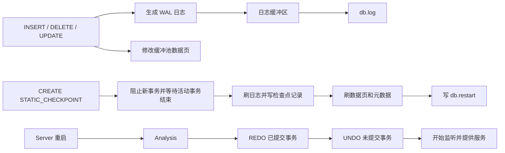

# 第十题：基于静态检查点的故障恢复

## 一、题目目标

本题要求在 RMDB 中实现完整的系统故障恢复能力，主要包括：

1. 为事务和数据修改生成 WAL 日志；
2. 保证日志先于数据页落盘；
3. 系统崩溃后执行 REDO 和 UNDO；
4. 支持以下静态检查点语句：

```sql
CREATE STATIC_CHECKPOINT;
```

5. 重启时能够从最近的有效检查点开始恢复；
6. 在大数据量下满足恢复时间要求：

```text
t2 <= 0.7 * t1
```

其中：

- `t1`：无检查点时，从 Server 重启到能够提供服务的时间；
- `t2`：有检查点时，从 Server 重启到能够提供服务的时间。

最终评测结果：

```text
AC

crash_recovery_without_checkpoint:
recovery time = 28.814681s

crash_recovery_with_checkpoint:
recovery time = 0.036073s
```

两组测试均通过一致性检查，检查点恢复时间远低于无检查点恢复时间。

---

## 二、总体设计

整个实现可以分为四条链路：



核心原则是：

- 运行阶段通过 WAL 记录事务历史；
- 检查点保存一个可信的恢复起点；
- 重启阶段先完成恢复，再开放 Server 端口；
- 所有恢复操作必须具有幂等性，重复执行不能破坏数据。

---

## 三、日志系统

### 3.1 日志类型

需要记录以下日志：

| 日志类型 | 作用 |
| --- | --- |
| `BEGIN` | 标记事务开始 |
| `INSERT` | 保存表名、RID 和插入后的记录 |
| `DELETE` | 保存表名、RID 和删除前的记录 |
| `UPDATE` | 保存表名、RID、修改前记录和修改后记录 |
| `COMMIT` | 标记事务成功提交 |
| `ABORT` | 标记事务已经完成回滚 |
| `CHECKPOINT` | 标记静态检查点及其活动事务集合 |

每条日志包含：

```text
log_type
lsn
log_tot_len
txn_id
prev_lsn
payload
```

`prev_lsn` 将同一事务的日志连接起来，恢复时可以沿事务日志链逆序执行 UNDO。

### 3.2 日志序列化

日志不能直接把 C++ 对象写入文件，而应按照固定布局序列化：

```text
固定日志头 + 变长记录内容 + RID + 表名
```

记录和字符串都先写入长度，再写入实际数据。恢复读取日志时必须检查：

- 日志头是否完整；
- `log_tot_len` 是否合理；
- 当前日志是否超出文件末尾；
- 日志记录是否合法。

如果系统崩溃时留下半条日志，只保留最后一条完整日志之前的内容，并截断损坏的尾部。

### 3.3 WAL 顺序

执行写操作时采用以下顺序：

```text
生成日志
  -> 写入日志缓冲区
  -> 获得 LSN
  -> 修改内存数据页
```

在脏页真正写入磁盘前，必须保证对应日志已经写入日志文件。检查点和正常关闭时需要强制同步日志。

提交事务时先追加 `COMMIT` 日志，再将当前日志缓冲区写入日志文件，最后才向客户端确认成功。这样可以避免客户端收到成功响应后，提交日志仍只存在于内存中。

---

## 四、静态检查点

### 4.1 Parser 到 Executor

语法层加入：

```sql
CREATE STATIC_CHECKPOINT;
```

执行链路为：

```text
Parser
  -> ast::StaticCheckpoint
  -> T_StaticCheckpoint Plan
  -> QlManager 检查点执行逻辑
```

生成 Parser 文件时出现过以下 Bison 警告：

```text
nonterminal useless in grammar: colList
```

这是 `colList` 产生式未被其他规则引用造成的普通警告，与检查点和恢复功能无关，不会导致编译失败。

### 4.2 阻止新事务

`TransactionManager` 中维护：

- `checkpoint_in_progress_`；
- `active_statements_`；
- `active_txns_`；
- 条件变量和检查点串行锁。

创建静态检查点时：

1. 设置 `checkpoint_in_progress_ = true`；
2. 新语句进入时等待检查点结束；
3. 检查点等待当前活动语句和显式事务全部结束；
4. 同一时间只允许一个检查点执行。

检查点完成或异常退出后必须清除状态并唤醒等待线程，否则 Server 会永久阻塞。

### 4.3 五步检查点流程

实现严格遵循题目要求：

```text
1. 阻止新事务，等待活动事务结束
2. 刷出检查点前的日志
3. 写入 CHECKPOINT 日志并同步
4. 刷出元数据、表文件、索引文件和缓冲池脏页
5. 将检查点日志偏移写入 db.restart
```

伪代码如下：

```cpp
auto active_txns = txn_manager->begin_static_checkpoint();

auto checkpoint_offset =
    log_manager->write_checkpoint_record(active_txns);

sm_manager->flush_for_checkpoint();
sm_manager->create_index_snapshots(checkpoint_offset);

log_manager->persist_restart_offset(checkpoint_offset);
sm_manager->cleanup_index_snapshots(checkpoint_offset);

txn_manager->end_static_checkpoint();
```

### 4.4 Restart 文件

`db.restart` 保存检查点记录在 `db.log` 中的字节偏移。

写入时不能直接覆盖正式文件，否则系统可能在写到一半时崩溃。正确方式是：

```text
写 db.restart.tmp
  -> fsync 临时文件
  -> close
  -> rename 为 db.restart
  -> fsync 数据库目录
```

重启时还必须验证偏移指向的确实是一条完整、合法的 `CHECKPOINT` 日志。若 Restart 文件损坏或偏移无效，则退回到日志起点恢复。

---

## 五、故障恢复

Server 启动时的顺序为：

```cpp
log_manager->initialize_from_disk();
recovery->analyze();
recovery->redo();
recovery->undo();
start_server();
```

因此评测中的恢复时间确实是从进程启动，到恢复完成并开始监听端口为止。

### 5.1 Analysis 阶段

首先确定扫描起点：

- 有合法 `db.restart`：从最近检查点开始；
- 没有检查点：从 `db.log` 的第一条日志开始。

扫描日志并维护事务状态：

| 日志 | 状态变化 |
| --- | --- |
| `BEGIN` | 加入未完成事务集合 |
| `INSERT/DELETE/UPDATE` | 记录该事务的操作日志 |
| `COMMIT` | 从未完成集合移除，加入已提交集合 |
| `ABORT` | 从未完成集合移除 |

### 5.2 REDO 阶段

REDO 只重做已经提交的事务：

- `INSERT`：在指定 RID 安装新记录；
- `DELETE`：删除指定 RID；
- `UPDATE`：在指定 RID 安装新记录。

恢复接口不能假设目标记录一定存在或一定不存在，因此实现为幂等操作：

```text
upsert_record_for_recovery
delete_record_for_recovery
```

即使数据页在崩溃前已经写入磁盘，再执行一次 REDO 也不会产生重复记录。

### 5.3 UNDO 阶段

对于崩溃时仍未提交的事务，按照日志逆序撤销：

| 原操作 | UNDO |
| --- | --- |
| `INSERT` | 删除插入记录 |
| `DELETE` | 恢复删除前记录 |
| `UPDATE` | 恢复修改前记录 |

UNDO 完成后写入 `ABORT`，并将恢复后的数据状态刷盘，避免下一次启动重复处理同一批未完成事务。

### 5.4 索引恢复

只恢复表文件而不恢复索引，会造成：

```text
顺序扫描结果正确
索引扫描结果错误
```

因此需要保证表记录与索引同步：

- REDO/UNDO 记录时同步删除旧索引项、插入新索引项；
- 检查点保存可用的索引快照；
- 无法可信复用快照时，根据恢复后的表记录重建索引；
- 更新索引键时同时处理旧键和新键。

---

## 六、大数据测试为什么会停服

功能正确后，最后两个测试仍然报告：

```text
server stops running at normal running phase
```

这不是恢复结果错误，而是 Server 在 Crash 之前的大规模插入和更新阶段耗时过长。

测试负载的关键形态是：

```sql
CREATE TABLE warehouse (...);

-- 大量 INSERT
INSERT INTO warehouse VALUES (...);

-- 对每个 w_id 单独执行一个事务
BEGIN;
UPDATE warehouse
SET w_ytd = ...
WHERE w_id = ...;
COMMIT;
```

如果表上没有索引，每条 `UPDATE` 都执行一次全表顺序扫描。

设记录数为 `n`，则总比较次数近似为：

```text
n 次 UPDATE * 每次扫描 n 行 = O(n^2)
```

当 `n = 100000` 时，最坏可达到约一百亿次记录判断，本地小数据能够通过，但 OJ 会在正常运行阶段超时。

---

## 七、最终性能优化

### 7.1 为等值更新建立内存 RID 缓存

针对无持久化索引情况下的：

```sql
UPDATE ... WHERE int_column = constant;
DELETE ... WHERE int_column = constant;
```

在 `RmFileHandle` 中按需建立：

```text
列偏移 -> unordered_multimap<int, Rid>
```

第一次查询时扫描一次表并建立映射，之后直接根据整数值找到候选 RID。

缓存只在 UPDATE/DELETE 定位阶段启用，普通 SELECT 仍走原执行路径，避免改变：

- 无 `ORDER BY` 查询的物理输出顺序；
- EXPLAIN ANALYZE 的扫描行数；
- FLOAT、CHAR 等类型的比较语义。

插入、删除和更新记录时同步维护缓存：

```text
INSERT -> 加入新 RID
DELETE -> 删除旧 RID
UPDATE key unchanged -> 不动缓存
UPDATE key changed -> 删除旧键并加入新键
ROLLBACK -> 通过相同记录接口恢复缓存
```

这样大规模逐行更新由 `O(n^2)` 降为接近 `O(n)`。

### 7.2 压缩缓存内存

早期版本使用：

```cpp
unordered_map<int, vector<Rid>>
```

对于大量唯一键，每个键都要单独分配一个 `vector`，会产生许多小对象。

最终改为：

```cpp
unordered_multimap<int, Rid>
```

它直接保存键与 RID 节点，降低了唯一键场景下的额外分配和内存开销。

### 7.3 降低 Buffer Pool 峰值内存

最初 Buffer Pool 为 256MB，后来调整为 64MB，最终使用：

```cpp
static constexpr int BUFFER_POOL_SIZE = 4096;
```

每页 4KB，对应约 16MB Buffer Pool。

测试中的大表文件远小于该容量，因此不会明显增加换页，却能显著降低 OJ 上的内存压力。

### 7.4 优化 WAL 追加

原实现每次写日志都执行：

```text
lseek(fd, 0, SEEK_END)
pwrite(...)
```

大量小事务会产生大量额外系统调用。

最终在 `DiskManager` 中维护：

```cpp
int64_t log_write_offset_;
```

第一次写入时通过文件状态获得末尾偏移，之后直接累加写入长度。日志截断或关闭文件时同步重置该偏移。

### 7.5 删除无意义的日志缓冲区清零

原实现每次刷日志后都会清零整个 4MB 日志缓冲区：

```cpp
memset(log_buffer_.buffer_, 0, sizeof(log_buffer_.buffer_));
```

每次提交都可能触发刷日志，在几十万事务下会造成巨量无效内存写入。

日志序列化会完整覆盖有效区域，写磁盘时也只写 `offset_` 范围，因此只需：

```cpp
log_buffer_.offset_ = 0;
```

不需要清空其余内容。

### 7.6 使用优化编译

项目原先强制使用：

```cmake
-O0 -g -ggdb3
```

大数据测试包含大量 Parser、Analyzer、Planner 和 Executor 调用，无优化编译会显著放大每条 SQL 的固定成本。

最终改为：

```cmake
set(CMAKE_CXX_FLAGS "-Wall -O2")
set(CMAKE_CXX_FLAGS_DEBUG "${CMAKE_CXX_FLAGS_DEBUG} -O2")
```

本地 10 万行压力测试的 normal 阶段由约 300 秒降低到约 140 秒。

---

## 八、中间错误与排查经验

### 8.1 将恢复失败误判为输出格式问题

早期曾重点检查 FLOAT 是否固定保留六位、最后一行是否换行等格式问题。

这些问题确实可能导致一致性比对失败，但本题最后两个测试的报错是：

```text
server stops running at normal running phase
```

它明确表示 Server 在 Crash 前就停止运行，不是恢复后的文本输出不匹配。

正确做法是先区分：

```text
answer mismatch             -> 数据或输出格式问题
server stops in normal phase -> 超时、崩溃、OOM 或连接问题
server fails after restart   -> 恢复流程或日志损坏问题
```

### 8.2 只用小数据验证

5000 行测试中：

```text
without_checkpoint recovery ≈ 0.458s
with_checkpoint recovery    ≈ 0.065s
```

虽然结果正确，但无法暴露 `O(n^2)` 的更新定位问题。

必须使用接近官方规模的压力测试：

```bash
python3 sql_test/run_large_recovery_probe.py --rows 100000 --workers 1
```

### 8.3 只关注恢复时间，忽略 normal 阶段

10 万行测试曾得到：

```text
t1 ≈ 7.2s
t2 ≈ 0.04s
```

恢复时间已经满足要求，但 normal 阶段接近 300 秒，所以 OJ 仍然会在 Crash 前终止 Server。

测试脚本应分别记录：

```text
insert time
update time
normal phase total time
recovery time
server RSS
```

### 8.4 过度怀疑线程和锁

排查过：

- 客户端线程未 detach；
- SIGPIPE 导致进程退出；
- 事务对象未释放；
- 锁表持续增长。

线程 detach 和忽略 SIGPIPE 是合理的健壮性修复，但不是主要性能根因。事务对象在 COMMIT 后已经释放，而当前项目的锁管理器接口基本为空实现，也不会形成巨大锁表。

真正的主要瓶颈是：

```text
无索引 UPDATE 的 O(n^2) 扫描
+ Debug 无优化编译
+ 高频日志系统调用
```

### 8.5 直接修改 FLOAT 输出

恢复测试要求 FLOAT 固定输出六位小数：

```text
15.500000
30.000000
```

曾尝试按有效小数位输出，导致恢复结果与标准答案不一致。最终必须保留题目要求的六位格式，不能把其他题目的输出习惯直接套到恢复题。

### 8.6 数据库目录残留

重复运行测试时，如果数据库目录没有清理，会出现：

```text
Table already exists
Create index failure
后续数据重复或事务失败
```

测试前应杀掉旧 Server 并删除测试数据库目录，避免把环境残留误判为恢复错误。

---

## 九、测试方法

### 9.1 编译

修改 CMake 编译参数后必须重新配置：

```bash
cd ~/Desktop/VMware/db2026
cmake -S . -B build
cmake --build build -j2
```

### 9.2 静态检查点烟雾测试

```sql
CREATE TABLE checkpoint_smoke (
    id INT,
    value INT
);

INSERT INTO checkpoint_smoke VALUES (1, 100);
CREATE STATIC_CHECKPOINT;
SELECT * FROM checkpoint_smoke;
```

检查：

- `db.log` 中存在检查点记录；
- `db.restart` 存在；
- Restart 文件偏移指向合法检查点；
- 重启后数据仍然正确。

### 9.3 无检查点恢复

```sql
CREATE TABLE t1 (id INT, num INT);

BEGIN;
INSERT INTO t1 VALUES (1, 1);
COMMIT;

BEGIN;
INSERT INTO t1 VALUES (2, 2);
crash
```

重启后：

```sql
SELECT * FROM t1;
```

只应存在已提交的 `(1, 1)`。

### 9.4 大数据对比测试

```bash
python3 sql_test/run_large_recovery_probe.py \
    --rows 100000 \
    --workers 1
```

检查：

- normal 阶段 Server 不退出；
- 无检查点恢复结果一致；
- 有检查点恢复结果一致；
- `t2 / t1 <= 0.7`；
- Server 内存处于可接受范围。

---

## 十、关键修改文件

| 文件 | 主要作用 |
| --- | --- |
| `src/parser/lex.l` | 识别静态检查点关键字 |
| `src/parser/yacc.y` | 解析 `CREATE STATIC_CHECKPOINT` |
| `src/parser/ast.h` | 静态检查点 AST |
| `src/optimizer/plan.h` | `T_StaticCheckpoint` 计划类型 |
| `src/execution/execution_manager.cpp` | 执行静态检查点五步流程 |
| `src/recovery/log_manager.h/.cpp` | 日志缓冲、序列化、刷盘、检查点记录 |
| `src/recovery/log_recovery.h/.cpp` | Analysis、REDO、UNDO |
| `src/storage/disk_manager.h/.cpp` | WAL 文件、Restart 文件、原子写入与同步 |
| `src/storage/buffer_pool_manager.cpp` | WAL 约束下刷数据页 |
| `src/system/sm_manager.cpp` | 刷元数据、表、索引和检查点快照 |
| `src/transaction/transaction_manager.cpp` | 事务状态与检查点并发控制 |
| `src/record/rm_file_handle.h/.cpp` | 幂等恢复接口与整数等值 RID 缓存 |
| `src/execution/executor_seq_scan.h` | UPDATE/DELETE 等值定位优化 |
| `src/portal.h` | 仅为更新和删除启用定位缓存 |
| `src/rmdb.cpp` | 启动恢复顺序、连接线程和异常处理 |
| `src/common/config.h` | Buffer Pool 大小 |
| `CMakeLists.txt` | 使用 `-O2` 优化编译 |

---

## 十一、总结

本题最终通过不能只依靠“把 REDO/UNDO 写出来”，而需要同时保证：

1. 日志格式完整且能够检测崩溃尾部；
2. WAL 顺序正确，提交日志在响应客户端前写入磁盘；
3. REDO/UNDO 幂等，表和索引保持一致；
4. Restart 文件采用原子、持久化的写入方式；
5. 静态检查点真正阻止新事务并等待活动事务结束；
6. 重启时在开放端口前完成恢复；
7. 大数据正常运行阶段不能出现 `O(n^2)` 扫描；
8. 控制内存、系统调用和 Debug 编译带来的性能损耗；
9. 测试时同时观察 normal 阶段和 recovery 阶段。

最终最关键的修复组合是：

```text
正确的 WAL + REDO/UNDO
+ 静态检查点与 Restart 文件
+ 幂等表/索引恢复
+ INT 等值 RID 缓存消除 O(n^2)
+ 缩小 Buffer Pool
+ WAL 尾偏移缓存
+ 删除无效日志缓冲区清零
+ 使用 -O2 编译
```

这套实现最终通过了全部恢复测试，并使带检查点的恢复时间从几十秒级降低到约 `0.036s`。
