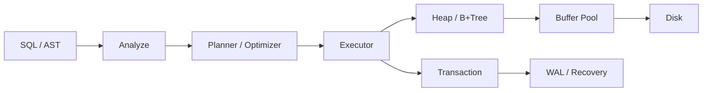
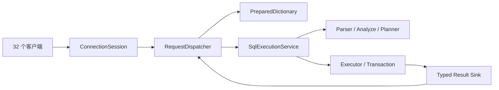
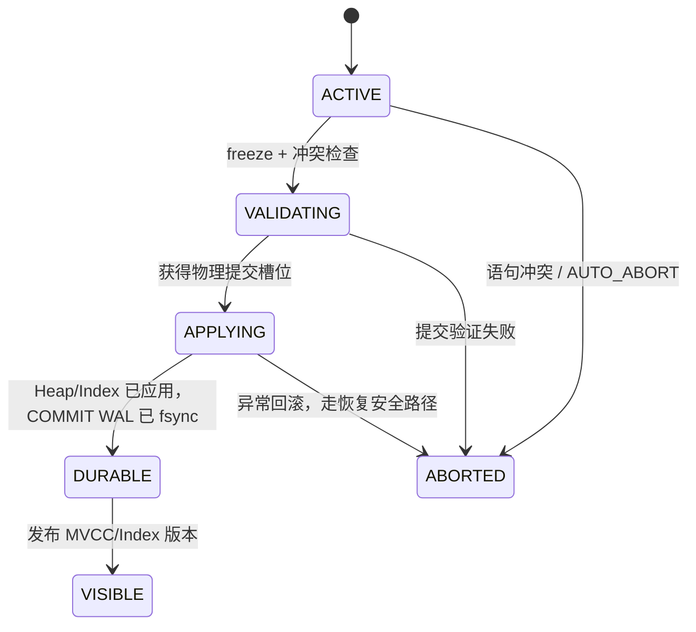

# 从初赛功能题到决赛性能测评：RMDB 设计、实现与优化历程

> 面向 2026 年全国大学生计算机系统能力大赛数据库管理系统设计赛答辩  
> 最终代码：`xin@44c52eb10ea25409a5f1cd669ef34231e81fc717`  
> 最终测评：2026-08-15 16:15:46，`PASS`，30,741.2 NewOrder/min

## 1. 结论摘要

我们的工作不是在现成数据库上增加几个 TPC-C 特例，而是沿着一条完整的数据库内核演进路线推进：

1. 从磁盘、缓冲池、记录管理器开始，补齐一个可运行的关系数据库内核；
2. 实现解析、分析、优化、执行、B+Tree、事务、MVCC/SSI、WAL、检查点和崩溃恢复；
3. 用初赛功能题建立正确性基线，再进入 TPC-C 的装载、查询、事务并发和恢复优化；
4. 面对决赛新协议和更严格的 ACID 门禁，重构为 Wire v3、类型化 prepared/batch 执行；
5. 最终以“事务私有写批 + 分片 MVCC 写意向 + 页/叶级批提交 + durable-before-visible”为核心，消除全局等待和逐行存储开销；
6. 通过逻辑优化、复合索引前缀、B+Tree 局部 crabbing、group commit、流式 WAL 恢复扫描和安全水位 GC，把正确性、吞吐、恢复和内存控制串成一条完整链路。

最终代码通过了 25 项功能测试、5 项恢复测试、32/32 COMMIT 持久化审计、9 表 25,045,714 行装载校验、三轮 32 客户端 TPC-C、崩溃前一致性和 SIGKILL 后恢复检查。排行榜指标为三轮中位数 30,741.2 NewOrder/min，合并 p50 为 13.218 ms，p99 为 69.372 ms。

最值得在答辩中强调的不是某个局部“快函数”，而是以下总体设计：

> 执行阶段先在事务私有空间形成逻辑修改，语句时立即做冲突检测；提交时按 Heap 页和 Index 叶分组写入，先形成并稳定化 WAL，再发布连续可见的提交时间戳。普通冲突只丢弃私有写批，不再触发物理回滚和全库 checkpoint。

## 2. 本文证据口径

本文综合使用四类证据：

- 初赛十道题、初赛性能题和决赛性能测评说明；
- 当前 `xin` 分支源码；
- 2026-05-24 至 2026-08-15 的 Git 提交历史；
- 最终正式性能报告，以及仓库中保存的早期/中间正式报告。

为避免答辩中过度归因，本文采用以下表述规则：

- “实现了”表示当前源码仍存在该机制；
- “提交引入”表示 Git diff 能确认该提交加入了相应代码；
- “提升了多少”只在有同口径 A/B 或正式报告端点时给出；
- 正确性修复、恢复加速和内存控制不会被直接说成 NewOrder 吞吐来源；
- 已经回退的实验单列说明，不算入最终方案；
- 不把最终 15,620.8 → 30,741.2 的两倍差值全部归因于最后一次 GC 修改，因为三轮吞吐波动较大，缺少同环境重复配对 A/B。

## 3. 赛题如何一步步塑造系统

### 3.1 初赛十道功能题

初赛不是十个彼此独立的小功能，而是在逐层搭建数据库：

| 题目 | 核心要求 | 我们形成的能力 | 代表提交 |
| --- | --- | --- | --- |
| 1. 存储管理 | DiskManager、BufferPool、LRU、记录页和扫描 | 页面 I/O、缓存、替换、Heap 记录增删改查 | `de0387b` |
| 2. 查询执行 | DDL、DML、DQL、语义分析、连接 | Parser → Analyze → Planner → Executor 主链路 | `0c2ef85` |
| 3. 唯一索引 | 单列/复合索引、点查、范围查、最左前缀、DML 维护 | B+Tree、IndexScan、表索引一致性 | `3f21374`、`35e6077` |
| 4. 查询优化 | 选择/投影下推、计划树、EXPLAIN ANALYZE | 规则优化、运行时 rows 统计 | `e381227` |
| 5. 聚合 | COUNT/MIN/MAX/SUM/AVG、GROUP BY、HAVING、ORDER BY/LIMIT | 聚合执行器、分组状态、类型化结果 | `dd8d651` |
| 6. UNION | 多分支合并、去重、排序、派生表、类型提升 | UnionExecutor、派生表分析与 schema 统一 | `f629b23` 及后续修复 |
| 7. Join 优化 | NLJ、INLJ、右表索引点查、多表左深树 | Join 动态索引绑定和执行统计 | `3760b34` |
| 8. 事务控制 | BEGIN/COMMIT/ABORT，表与索引共同回滚 | write set、UNDO、锁释放与事务生命周期 | `7082660` |
| 9. SI/SER | MVCC 快照、写写冲突、SSI 谓词依赖和立即中止 | 版本链、读/写集合、rw 反依赖图 | `a74c2db`、`ecd6cd5`、`f6104c2` |
| 10. 恢复 | WAL、REDO/UNDO、静态检查点、崩溃重启 | 日志管理器、RecoveryManager、checkpoint | `860162a` |

这十题确定了后续性能优化必须尊重的抽象边界：优化可以改变算法和锁粒度，但不能绕过解析、可见性、索引维护、事务原子性和 WAL。

### 3.2 初赛性能题

初赛性能题首次把这些模块放进同一个 TPC-C 闭环：

- 通过 `LOAD` 导入 9 张表；
- 执行 NewOrder、Payment、OrderStatus、Delivery、StockLevel；
- 以 NewOrder 成功提交速率排名；
- 压测后检查 TPC-C 不变量；
- SIGKILL 后要求已提交事务可恢复；
- 禁止根据固定表名、字段名或 SQL 文本硬编码。

因此，性能问题不再只是“SELECT 是否快”，而是：

```text
解析与计划开销
  + Heap/Index 访问开销
  + 热点行写冲突
  + ABORT 回滚成本
  + WAL 写入与 fsync
  + 大规模装载
  + 长时间运行后的版本/缓存占用
  + 崩溃后的恢复时间
```

### 3.3 决赛相对初赛的关键变化

| 维度 | 初赛阶段 | 决赛阶段 | 对实现的影响 |
| --- | --- | --- | --- |
| 网络 | 旧文本 SQL、`output.txt` | Wire v3 类型化 frame | 重构网络入口与结果模型 |
| 高频执行 | 逐条 SQL | `PREPARE_SET + EXEC_BATCH` | 复用计划、参数绑定、聚合响应 |
| 失败处理 | 传统 ERROR/ABORT | `AUTO_ABORT`，响应前完成回滚 | 协议状态机与事务生命周期统一 |
| 数据 | 较早规格 | 50 仓、约 2500 万行、order_line 5～15 动态 | LOAD、内存和索引必须可扩展 |
| 并发 | 16～32 客户端公开信息 | 固定 32 客户端、热点轮盘 | 不能用全局串行 admission |
| 隔离 | 以 SI 性能为主 | 排名 SI，功能还测 SER/SSI | 快路径不能破坏 SSI 语义 |
| 数值 | 文本 FLOAT 为主 | FLOAT32 位模式、0 ULP、SUM 规则 | 类型化绑定与聚合必须精确 |
| 聚合 | 基础聚合 | 原生 `COUNT(DISTINCT)` | StockLevel 不能客户端去重 |
| 持久化 | crash 后正确 | 每个 COMMIT ACK 的 WAL+fsync 可审计 | durable watermark 与 group commit |
| 恢复 | 正确恢复 | 90 秒内 Wire `show tables;` 就绪 | WAL 扫描、loser 处理和定向 flush |
| 评分 | 正确后比较性能 | 三个 150 秒窗口中位数 | 必须兼顾稳定性而非单轮峰值 |

这意味着原来围绕 `output.txt` 或单连接串行执行的优化全部失去中心地位，系统必须转向真正的多连接、批协议和并发存储架构。

## 4. 完整演进时间线

### 4.1 5 月：搭建可执行数据库骨架

这一阶段完成了从页面到 SQL 的纵向链路：

- `de0387b`：实现磁盘文件、页面读写、缓冲池、LRU 和记录扫描；
- `0c2ef85`：补齐 DDL/DML/DQL、语义检查、SeqScan、Projection、NLJ；
- `3f21374`：实现唯一 B+Tree、复合索引、IndexScan，以及 INSERT/UPDATE/DELETE 对索引的同步维护；
- `7082660`：显式事务使用 write set，在 ABORT 时逆序恢复 Heap 和 Index；
- `e381227`：形成 EXPLAIN ANALYZE、谓词/投影下推和节点 rows 统计；
- `dd8d651`：加入聚合、分组、HAVING、排序和 LIMIT；
- `f629b23`：加入 UNION、去重、派生表、排序和类型兼容。

这个阶段最大的设计价值，是把数据库分成清晰的层：



后续所有高性能机制都沿用这条主链，而不是另写 TPC-C 专用执行器。

### 4.2 6 月：从单事务正确走向并发、SSI 和恢复

事务题和恢复题将系统从“能改数据”推进到“失败后仍正确”：

- `860162a` 实现 BEGIN/COMMIT/ABORT 与 INSERT/UPDATE/DELETE 日志、REDO/UNDO 和静态检查点；
- `3760b34` 完成 NLJ/INLJ 及专项 SQL 测试；
- `a74c2db` 开始实现可配置 SI/SER；
- `ecd6cd5` 修复 UPDATE/DELETE 扫描没有登记 SER 记录读/谓词读的问题；
- `f6104c2` 把 MVCC UPDATE/DELETE 改为 pending version，提交时统一落盘；
- `074440a`、`e48acf7`、`a43807a` 把写写冲突检查提前到语句时，避免把应当 abort 的冲突误判为唯一约束 failure；
- `86f8c03` 修复回滚时使用“事务最终可见值”而不是“当前物理值”导致的索引回滚错误；
- `255b554`、`7d02020` 修复同一事务插入后更新，以及并发交叉更新的双重回滚。

这一阶段确立了三个后来一直保留的原则：

1. 表、索引、MVCC 版本必须作为一个原子单元提交或回滚；
2. SI 的写写冲突必须在语句边界尽早发现，提交阶段仍做最终验证；
3. SER 不只记录命中行，还要记录范围/空结果谓词，否则无法发现幻读和写偏序。

### 4.3 7 月上旬：第一次 TPC-C 正确性与性能拉锯

初赛 TPC-C 暴露了单元测试看不到的问题：

- IndexScan 的批量物理读取曾绕过 MVCC 版本链，导致读到错误版本；
- 高并发下提交、GC 和插入之间出现 ABBA 锁序；
- 删除后的旧版本可能在 checkpoint 恢复后“复活”；
- 事务越多，热点 `district`、`stock` 的冲突与回滚成本越高；
- 长时间压测会累积版本和低占用索引页。

关键修复包括：

- `dda5ea3`：IndexScan 重新经过 MVCC 可见性；
- `11cc992`：修复陈旧版本读导致丢失更新；
- `b8fb446`：加入 MVCC GC，控制长时间运行内存；
- `e527426`：修复 commit/GC 与 insert 的 ABBA 死锁；
- `a47cd1b`：修复 checkpoint 后已删除行复活；
- `0ece5b5`、`b0312bd`：加强提交冲突和原子可见性；
- `3b13d7e`：SeqScan/IndexScan 按页批读，但仍保留逐行可见性过滤；
- `e6f8ea6`、`36639e0`、`8a329d7`：清理 settled 唯一键候选、增量 GC、跳过不可能冲突。

当时曾通过限制同时活跃 SI 事务来换取稳定正确性，早期正式结果约为 947 NewOrder/min。这个方案说明“少回滚”有价值，但也暴露出全局准入的结构上限：32 个客户端最终仍排成一条队。

### 4.4 7 月底：切换到决赛 Wire v3

决赛协议不是网络层的局部修改，而是从结果模型到事务错误处理的整体重构：

- `ac9ffb5`：Wire v3 codec，大端 frame、类型编码和长度校验；
- `396d68a`：`read_exact`/`write_all` 等价循环与 8 字节握手；
- `a8f41c6`：类型化执行结果，不再依赖文本表格；
- `14719a7`：`PREPARE_SET`、`EXEC_BATCH`、prepared 字典和批结果；
- `6a523dd`：会话状态、AUTO_ABORT、失败 batch 唯一响应；
- `f0b7f41`：拆分 `rmdb.cpp`，形成 `ConnectionSession → RequestDispatcher → SqlExecutionService`。

最终网络路径为：



性能收益来自：SQL 模板只准备一次、batch 只传 statement id 和类型化参数、DML 不逐条返回 ACK、查询结果不重复传 schema。更重要的是，失败 batch 会先同步回滚，再丢弃部分查询结果并返回一个 `BATCH_RESULT`。

### 4.5 8 月 6～13 日：装载、恢复和批扫描工程化

这一阶段主要解决“能否跑完整正式流程”：

- LOAD 根据 CSV header 建立 schema 列映射，避免固定列顺序；
- LOAD 流式读入，使用一个紧凑 `BULK_INSERT_TUPLES` 回滚记录保存 RID，避免每行一个包含表名的 `WriteRecord`；
- `9ecb3a4` 优化 LOAD 和崩溃后检查路径；
- `b097291`、`05f92b0`、`046d1bc` 加入记录缓冲池，批读时复用 `RmRecord` 内存，SeqScan 消费后回收；
- 恢复侧跳过 active loser 的物理 REDO，只记录 offset 供逆序 UNDO，避免 loser 与 committed winner 发生唯一索引冲突；
- 有 checkpoint 时恢复索引快照，只 flush 实际 touched 的对象，并为端口释放延迟加入有限重试；
- 多轮 MVCC 分片/提交拆分试验中，错误版本被回退到正确基线，再重新设计。

这段经历的重要教训是：恢复优化通常不提高正式测量窗口内的吞吐，却决定性能成绩是否有效。高吞吐产生更多 WAL，如果恢复仍是逐记录、多次 `pread/stat`，最终会因 90 秒就绪门禁得 0 分。

### 4.6 8 月 14～15 日：无全局等待的最终存储架构

最终重构以 `2dd1717` 为基础，随后按小步提交完成：

| 提交 | 主要内容 | 性质 |
| --- | --- | --- |
| `2dd1717` | PageGuard、分片 BufferPool、并发 Heap/Index、group commit 基础 | 架构底座 |
| `76d7167` | Buffer Pool 页面数据上限 2 GiB | 资源门禁 |
| `2d4172b` | `TransactionWriteBatch` | 核心性能架构 |
| `0d834ff` | SI 写延迟到验证后的提交阶段 | 原子性 + 降低 abort 成本 |
| `62f7144` | 256 分片 MVCC、record/unique intent fail-fast | 并发扩展 |
| `940fbfc` | 去掉全局 B+Tree split 锁，局部 crabbing | 索引并发 |
| `e20ee64` | 按 Heap page 和 Index leaf 批应用 | 存储吞吐 |
| `af29f3c` | 批提交的 WAL/持久化边界与故障注入 | 持久性 |
| `46525ca`、`447cd54` | 恢复 UPDATE/DELETE/INSERT 的语句时 SI/SSI abort | 正确性 |
| `88da772` | 修复 B+Tree batch mutation 活锁 | 并发正确性 |
| `2de44d4` | 利用 Heap free-page candidates 分配 staged insert RID | 插入性能 |
| `c874c0e` | 逻辑优化、复合前缀评分、同叶批写、轻量 abort | 关键热路径优化 |
| `bc28568` | staged write 与历史索引候选可见性修复 | 正确性 |
| `2ca53b0` | 连续可见提交前缀 | 提交原子可见性 |
| `b0b44e8` | 收窄不安全 B+Tree 并发路径 | 正确性 |
| `34ce7b5` | WAL 顺序缓冲扫描与恢复复用 | 恢复性能 |
| `44c52eb` | 安全水位 GC 释放最终版本与 `TxnControl` | 内存稳定性 |

## 5. 最终系统的关键实现

### 5.1 协议与 prepared 执行

当前 Wire 层实现：

- `RMDB/3.0` 8 字节握手；
- 8 字节大端 frame header；
- payload 和诊断长度上限；
- INT32、FLOAT32 原始位和 CHAR 实际长度编码；
- `EXEC_STREAM` 的 `META → ROW* → RESULT_END`；
- `PREPARE_SET` 全量验证后原子替换字典；
- `$1...$n` 稠密参数检查，字符串内 `$n` 不当作 marker；
- `EXEC_BATCH` 严格顺序执行，成功只返回一个压缩结果；
- AUTO_ABORT 在响应前回滚活动事务并清空部分结果。

prepared 对象保存可复用计划和输出 schema，每次 operation 只绑定真实类型化参数。这样既减少解析/计划开销，也避免把 CHAR/FLOAT 拼回 SQL 后产生转义和精度问题。

当前协议层会把相邻、相同 prepared INSERT 合并交给 `BatchInsertExecutor`；其它 operation 仍按语义顺序执行。但无论协议是否合并，事务内所有 SI 写最终都会汇入同一个 `TransactionWriteBatch`，因此存储提交仍是事务级批处理。

### 5.2 查询优化器：让索引真正进入热路径

最终 `Planner::logical_optimization()` 不再是空函数，主要做四件事：

1. **谓词规范化和去重**：统一列列比较方向，删除重复条件；
2. **等值类传播**：若 `A.x = B.y` 且 `A.x = 常量`，在类型和长度一致时推导 `B.y = 常量`；
3. **复合索引前缀评分**：按“连续 EQ 前缀 + 最多一个 RANGE”评分，连接列也可以由已连接表动态绑定；
4. **通用 Join 排序**：优先选择与已连接集合相连、索引前缀长、本地过滤多的表。

例如对复合索引 `(w_id, d_id, o_id, number)`，系统不是只看某一个条件，而是合并：

- 本表常量等值条件；
- 外表传入的 Join 等值绑定；
- 第一处范围条件。

满足完整键时走点查，满足真前缀时构造范围，前缀不连续则回退到通用扫描。所有原始 WHERE/JOIN 条件仍由 Filter/Join 重新验证，因此索引只是缩小候选集，不改变 SQL 语义。

这项优化对 Delivery、OrderStatus、StockLevel 和恢复后一致性联表非常关键，也减少了热点事务持有快照和写意向的时间。

### 5.3 批扫描与记录缓冲复用

早期 iterator 模型对每条记录重复执行：解析 bitmap、pin/unpin 页面、分配 `RmRecord`、调用可见性函数。最终保留的优化是：

- RmScan 进入一页时一次解析该页 bitmap 并缓存全部有效 RID，页内迭代不再反复获取页头；
- SeqScan 一次取一页的候选记录；
- IndexScan 先收集 RID，再按 Heap 页分组读取；
- `RmRecordPool` 复用记录缓冲，减少频繁 malloc/free；
- 聚合执行器可请求 bulk read；
- 每条候选记录仍经过 MVCC 可见性和原谓词过滤。

这里最重要的正确性教训是：批量读取只能合并物理访问，不能跳过版本选择。曾经绕过 `get_visible_record()` 的优化在并发 TPC-C 下造成一致性失败，修复后批读和 MVCC 分层重新对齐。

### 5.4 事务私有逻辑写批

`TransactionWriteBatch` 是最终架构的核心接口。INSERT/UPDATE/DELETE 在 SI 下不立即修改 Heap 和 Index，而是登记：

```text
INSERT: table + file_id + TempRowId + after-image
UPDATE: table + file_id + RID + before-image + after-image
DELETE: table + file_id + RID + before-image
```

同一事务内：

- 多次 UPDATE 合并为最初 before + 最终 after；
- UPDATE 后 DELETE 合并为 DELETE；
- INSERT 后 UPDATE 直接更新临时 after-image；
- INSERT 后 DELETE 直接消去该逻辑写；
- 读路径用 overlay 返回自己的最新写。

`freeze()` 后，已有 RID 的修改按 `file_id/page_no/slot_no` 排序，插入按临时 id 稳定排序。这为提交时按页分组提供了天然输入。

这一设计同时解决三个问题：

1. 普通冲突发生在物理修改前，abort 只需丢弃私有写批；
2. 一个 NewOrder 的多条写可以在提交时合并为页/叶批；
3. 未提交写不会通过物理 Heap 或 Index 泄漏给其它事务。

### 5.5 分片 MVCC 与 fail-fast 写意向

最终 `MvccStore` 使用 256 个 shard，分别保存：

- RID → 版本链；
- RID → 当前 record intent owner；
- `(index_id, binary_key)` → unique intent owner；
- 增量 GC 的 dirty key 集合。

写事务先尝试获得 record/unique intent：

- 已经由本事务持有：幂等成功；
- 旧 owner 已 VISIBLE/ABORTED：可以接管；
- 其它活跃事务持有：立即返回写冲突，不在条件变量上等待。

这样不会让一个热点 `district` 或 `stock` 写者把不相干的 31 个连接挂在全局等待队列上。冲突事务尽早失败并由客户端重试，未冲突的不同 RID、不同索引键可以落在不同 shard 并发执行。

排名默认不设置 SI 全局 admission 上限；仅允许通过环境变量做诊断。物理 apply 阶段采用默认最多 16 个并发提交，避免无限制地让 32 个事务同时修改页面、索引和 WAL，在吞吐、内存和锁竞争之间取平衡。

### 5.6 durable-before-visible 提交状态机

最终提交状态可以概括为：



完整提交链路是：

1. 冻结事务私有写批；
2. 为 staged INSERT 从 Heap free-page candidates 预留槽位并解析 TempRowId；
3. 安装 pending MVCC 版本；
4. 状态从 ACTIVE 变为 VALIDATING；
5. 对全部 touched shard 做写写冲突和物理 before-image 复核；
6. 状态进入 APPLYING；
7. 一次性批量追加所有 row WAL，得到各行 LSN；
8. 按 Heap 页应用 mutation，每页只取一次写 guard；
9. 按 Index fd/leaf 应用排序后的 mutation；
10. 追加 COMMIT WAL；
11. `force_flush_up_to(commit_lsn)`，确认 `durable_lsn >= commit_lsn`；
12. 发布 Heap/Index 对应的 MVCC 版本；
13. 推进“连续完成的提交时间戳前缀”；
14. 释放 intents，返回 COMMIT 成功。

顺序的核心不变量是：

> 其它事务只能看到完整旧状态，或者看到已经完成 Heap、Index、WAL 稳定化后的完整新状态，不能看到“版本已发布但索引还没更新”的中间状态。

`TxnRegistry` 将“分配 commit timestamp”和“推进可被新快照捕获的 commit frontier”分开。并发事务即使完成顺序不同，新快照也不会越过尚未发布的时间戳空洞；失败提交消耗时间戳但被标记为已完成空洞，使后续连续前缀能够继续前进。

### 5.7 按 Heap 页和 B+Tree 叶批量提交

`StorageCommitExecutor` 把冻结写批转换为两组工作：

- `HeapPageKey(fd, page_no) → HeapMutation[]`；
- `IndexFd → IndexMutation[]`。

Heap mutation 在同页内按 slot 排序，一次 `apply_page_batch()` 完成，减少重复 pin、锁和 bitmap 解析。Index mutation 先按 key 排序；同一叶页能够容纳时，在一个写 guard 中执行一组 INSERT/DELETE。

B+Tree 并发采用两条路径：

- **安全叶快速路径**：读遍历定位叶页，切换写 guard 后核验 generation、叶类型、键范围、前后兄弟；安全则直接插入；
- **结构修改路径**：叶页不安全时重启，使用 parent-before-child crabbing，只保留不安全后缀；分裂兄弟按物理页号/左到右顺序加锁；根锁只用于替换 root page id。

批写还设置保守回退：如果叶链物理页号反向、空 successor 或 generation/边界校验失败，就放弃批快速路径，回到已验证的一键结构修改。性能优化的前置条件不成立时选择正确慢路径。

### 5.8 Buffer Pool：分片页表、frame 锁和 RAII PageGuard

最终 BufferPool 的关键变化：

- page table 分成 64 个 shard；
- 每个 frame 独立维护 metadata latch 和 content shared_mutex；
- `BasicPageGuard/ReadPageGuard/WritePageGuard` 以 RAII 管理 pin、内容锁、dirty 和 page LSN；
- 通过 frame generation 检查页面是否在并发过程中被换出复用；
- 脏页写出前执行 `force_flush_up_to(page_lsn)`，保持 WAL-before-data；
- Buffer Pool 页面数据最多 2 GiB，为 MVCC、索引、WAL 和 32 个连接留出 RSS 余量。

这解决了早期一个全局 BufferPool latch 在 32 连接下的争用，也让 B+Tree/Heap 批处理能够安全地“一页一个 guard”。

### 5.9 WAL 批写、group commit 与轻量 abort

提交时所有 row log 使用 `add_logs_to_buffer()` 一次进入 WAL 缓冲，COMMIT 再加入同一 WAL 链。`force_flush_up_to()` 的第一个等待者成为 group leader，默认等待 1 ms，让同时完成逻辑提交的其它线程追加 COMMIT，然后一次 write + fsync；每个事务仍等待自己的 LSN 被 durable watermark 覆盖。

普通 staged-write 冲突没有物理副作用：

- 丢弃 `TransactionWriteBatch`；
- 删除 pending 版本和 intents；
- 追加有序 ABORT record；
- 不执行全库 `flush_for_checkpoint()`；
- 不为这一条 ABORT 单独 fsync。

如果崩溃导致该 ABORT record 丢失，恢复会把事务当作 loser；由于它从未修改物理状态，UNDO 仍得到正确旧状态。只有真正发生物理回滚或已进入 apply 的异常 abort，才走 checkpoint flush 和强制日志持久化路径。

### 5.10 WAL 流式扫描与恢复

高吞吐会放大 WAL，恢复如果每条日志分别读取 header/body 并反复查询文件大小，会成为启动瓶颈。最终 `LogRecordScanner`：

- 使用固定容量缓冲区顺序读取；
- 保留 buffer 尾部并处理跨 buffer record；
- 遇到末尾不完整/非法 record 时停止并给出 valid end；
- analyze 和 redo 复用同一扫描器；
- analyze 得到的 max LSN 和 valid end 直接初始化 LogManager，避免第二次全量扫描。

恢复语义为：

- committed winner 执行 REDO；
- 已有 ABORT record 的事务不重放原始 action；
- crash 时 active loser 只登记 action offset，不先做物理 REDO；
- loser action 按 offset 逆序 UNDO；
- 完成 undo 后先持久化恢复结果，再写 ABORT record。

跳过 active loser 的物理 REDO尤其重要：否则 loser 的临时唯一键可能与 winner 冲突，即使后续 UNDO 也无法安全越过该错误。

仓库中的同一份约 35.1 MiB WAL 本地采样显示，恢复相关系统调用从约 63.5 万次降到约 3,312 次，约减少 99.5%。这项优化保障 90 秒重启门禁，不应直接算作 NewOrder 测量窗口吞吐提升。

### 5.11 安全水位 MVCC GC

最终提交 `44c52eb` 修复了“每个最终版本都永久保留完整 record 和 `TxnControl`”造成的内存增长。

GC 的 watermark 是所有未完成 MVCC 事务 `start_ts` 的最小值；没有活跃旧快照需要某个最终版本时：

- 删除 watermark 之前的过旧版本；
- 若历史只剩一个已提交且不晚于 watermark 的最终版本，直接删除整条内存历史；
- 未来读者从已经应用完成的物理 Heap 状态读取；
- INSERT 边界在仍有更老快照时继续保留，防止旧快照错误看到新行；
- SER 的 settled 依赖元数据独立清理。

主提交路径每 256 次 MVCC commit 触发一次单 shard 增量清理；显式 GC 可以扫描全部 256 shard。这样避免全量 stop-the-world，也把长期运行内存稳定性纳入事务设计。

## 6. 各项优化如何作用到性能

| 层次 | 原瓶颈 | 最终机制 | 主要收益 | 必须保护的语义 |
| --- | --- | --- | --- | --- |
| Wire | 重复 SQL、schema、DML ACK、RTT | prepared + typed batch | 降低解析、网络与响应开销 | operation 顺序、AUTO_ABORT |
| Optimizer | 复合索引利用不足、Join 中间结果大 | 等值传播、前缀评分、Join 排序 | 减少扫描行、缩短事务 | 原谓词全部复核 |
| Scan | 逐 RID pin/分配/bitmap 解析 | 页级 batch + record pool | 降低 CPU、锁和内存分配 | MVCC 可见性不绕过 |
| MVCC | 全局状态锁、冲突等待 | 256 shard + fail-fast intent | 不相关事务并行，热点冲突早失败 | SI/SSI 冲突规则 |
| Transaction | eager physical write，abort 很重 | 私有 logical write batch | 合并多次写，普通 abort 无物理回滚 | own-write visibility |
| Heap | 每行一次页面访问 | page mutation batch | 一页一次 guard/bitmap 更新 | page LSN、before-image |
| B+Tree | 全局 split 锁、逐行重走根 | local crabbing + leaf batch | 降低根路径和结构锁竞争 | generation、边界、唯一性 |
| WAL | 每事务独立同步 | row-log batch + group commit | 共享 write/fsync | ACK 等待自身 durable LSN |
| Abort | 无物理写也 checkpoint+fsync | volatile-only abort | 大幅降低冲突失败成本 | loser 恢复等价 |
| Recovery | 逐记录小读、重复扫描 | 顺序缓冲 scanner | 缩短重启与系统调用 | REDO/UNDO winner/loser |
| Memory | 终态版本永久保留 | watermark GC | 防止长测 RSS 超限 | 老快照边界 |

## 7. 性能实验中的有效结果与失败教训

### 7.1 早期有测量依据的局部收益

早期同口径 quick benchmark 曾得到：

- 纯内存 MVCC abort 不单独 checkpoint/fsync：16-client NewOrder 从约 605 提升到 785，约 +29.7%；
- Buffer 页表共享/分片与 frame 独立状态锁：约 +4.5% NewOrder；
- B+Tree 点查去每层临时堆分配：约 +4.57%；
- Parser 锁只覆盖 lexer/parser 和 parse tree 复制，Analyze/Planner/Executor 移到锁外。

这些数字来自当时的短时基线，不应直接相加，也不能外推为最终正式提升比例。最终架构后来进一步重构了 Buffer、B+Tree、MVCC 和提交路径。

### 7.2 已回退的实验

| 实验 | 现象 | 最终处理 |
| --- | --- | --- |
| commit-apply 公平 gate | 某一锁等待下降，但 MVCC 等待上升，吞吐下降 | 回退 |
| 单 RID 直接读取 | 门禁通过，但 tpmC 下降约 7.75% | 回退 |
| 批量 MVCC 整页一次长持锁 | 获取次数少，但热点临界区变长 | 回退 |
| abort checkpoint coalescing | 合并次数很少，新 latch 反而增加等待 | 回退 |
| Parser/B+Tree 热路径诊断计时 | 诊断本身显著降低 quick 吞吐 | 只保留离线结论 |
| 早期两阶段“先发布版本、后应用索引” | 小测更快，大规模暴露部分提交可见 | 回退并改为 durable-before-visible |
| WAL 锁内摘 batch、锁外写盘 | 扩大日志状态变量，缺少充分正确性证据 | 回退后重新以 durable watermark 设计 |
| B+Tree 递归 merge/redistribute | 高提交率下父子指针断言失败 | 采用保守 lazy deletion/安全结构路径 |
| 全局 SI=1 admission | 降低冲突但形成串行上限 | 最终排名默认取消 |

最重要的教训是：局部锁等待下降不等于端到端吞吐上升；任何“先发布、后补物理状态”的方案即使短测很快，也会破坏表/索引/MVCC 的原子可见性。

## 8. 最终正式测评结果

### 8.1 总体结果

| 指标 | 最终值 |
| --- | ---: |
| 结论 | PASS |
| 排名指标 | **30,741.2 NewOrder/min** |
| Round 1 | 23,943.2 |
| Round 2 | 42,520.4 |
| Round 3 | 30,741.2 |
| pooled p50 | 13.218 ms |
| pooled p99 | 69.372 ms |
| pooled average | 17.526 ms |
| pooled max | 273.313 ms |
| abort/abandoned rate | 25.06% |
| 仓库覆盖 | 50/50 |
| TPC-C CPU 平均 | 646.6%（16 核主机的 40.4%） |
| 进程树峰值 RSS | 5.32 GiB |
| 峰值数据库磁盘 | 13.61 GiB |

30,741.2 NewOrder/min 相当于排行榜中位轮约 512.35 笔 NewOrder/s。三轮正式窗口共提交 566,195 笔各类事务，平均约 1,258.2 committed tx/s。

### 8.2 装载和正确性

| 阶段 | 结果 |
| --- | --- |
| 编译 | 25.53 s，Release O2，二进制 1.59 MiB |
| 功能测试 | 25/25 PASS |
| 恢复测试 | 5/5 PASS |
| COMMIT 持久化 | 32/32 ACK 由 fsync 覆盖 |
| LOAD | 118.28 s，9 表 25,045,714 行 |
| LOAD 吞吐 | 约 211,749 行/s |
| LOAD 峰值 RSS | 2.31 GiB |
| 崩溃前一致性 | 13 项通过 |
| 崩溃后聚合 | 44 项通过 |
| 崩溃后关系检查 | 5,974 项通过 |
| 崩溃后恢复与检查 | 61.09 s |

最终峰值 RSS 5.32 GiB，约为 8 GiB 限制的 66.5%，说明 Buffer Pool 上限和 MVCC GC 留出了必要余量。

### 8.3 各事务完成情况

| 事务 | Attempted | Committed | Abandoned | Completion | p50 | p99 |
| --- | ---: | ---: | ---: | ---: | ---: | ---: |
| NewOrder | 339,984 | 243,012 | 96,972 | 71.48% | 13.218 ms | 69.372 ms |
| Payment | 324,912 | 235,632 | 89,280 | 72.52% | 5.820 ms | 40.653 ms |
| OrderStatus | 30,222 | 30,222 | 0 | 100% | 4.515 ms | 22.999 ms |
| Delivery | 30,195 | 27,103 | 3,092 | 89.76% | 46.916 ms | 441.698 ms |
| StockLevel | 30,226 | 30,226 | 0 | 100% | 12.866 ms | 34.004 ms |

这张表说明最终方案没有只优化 NewOrder：五类事务都有有效提交，Delivery 处理真实队列，OrderStatus/StockLevel 全部完成。不过写事务仍有明显冲突/放弃空间，Delivery 尾延迟也是后续优化重点。

### 8.4 历史提升的合理比较

可以从三个不同口径观察演进，但不能混为一组严格 A/B：

1. 7 月中早期正式结果约 947 NewOrder/min，到最终 30,741.2，约 32.46 倍。两次赛题协议和代码架构差异较大，只适合说明整个项目演进量级；
2. 最终冲刺的正确性基线 `2de44d4` 为 134 NewOrder/min，到最终 30,741.2，约 229.41 倍。两个端点都 PASS，能说明 8 月 15 日逻辑优化、B+Tree 批写、abort、可见性、恢复和 GC 修复共同消除了结构性瓶颈；
3. `34ce7b5` 的正式结果为 15,620.8，`44c52eb` 最终为 30,741.2，约 1.97 倍。但两次三轮波动均明显，最后一提交主要是 GC 内存修复，所以不能把整段差值都归因于 GC。

早期 `2de44d4 → 34ce7b5` 的同文档端点显示：

- 134 → 15,620.8 NewOrder/min，约 116.57 倍；
- p50 5,742.599 ms → 13.844 ms；
- p99 14,701.886 ms → 63.665 ms。

这说明性能跃迁的本质是从秒级排队/扫描/锁等待，转为十毫秒级的索引、批提交和并发执行链路。

## 9. 我们可以主张的创新点

答辩中建议使用“本项目的创新组合/针对 RMDB 的新设计”，不要无证据声称“业界首创”。

### 9.1 事务私有逻辑写批与通用存储提交器

不是在 TPC-C SQL 层识别 NewOrder，而是在任意 SI INSERT/UPDATE/DELETE 下统一收集 logical write，提交时再解析 RID、WAL、Heap 和 Index delta。它同时提供 own-write overlay、写合并、普通 abort 零物理回滚和事务级页批处理。

### 9.2 “持久化后发布 + 连续提交前缀”

将 commit timestamp 的分配、版本发布和新快照可见前缀分离，解决并发提交乱序造成的可见性空洞。新快照不会看到尚未完成的低时间戳事务，也不会因一个失败时间戳永久停止推进。

### 9.3 复合索引前缀的统一评分

把本地常量、等值传递和外表 Join binding 统一到“最长连续索引前缀”模型，既服务单表查询，也服务 INLJ 和多表连接顺序选择，不依赖 TPC-C 名称。

### 9.4 页/叶级批提交与可验证快速路径

写批先按 Heap page 和 Index leaf 聚合；B+Tree 快速路径使用 generation、键范围、兄弟链和物理锁序验证，失败时回退结构路径。该机制不是简单去锁，而是“乐观定位 + 加锁后重验证 + 正确慢路径”。

### 9.5 分片 fail-fast MVCC 写意向

用 256 shard 将版本、RID 写意向和唯一键意向分开；热点冲突立即 abort，不让事务无界等待；不相干记录保持并行。SER 谓词依赖独立于排名 SI 热路径，但仍在语句时立即中止规定 victim。

### 9.6 恢复与正常执行共享可审计边界

正常提交通过 row WAL batch、COMMIT LSN、durable watermark 和 page LSN 保证 WAL-before-data；恢复用同一 WAL 顺序 scanner 做 analyze/redo，并对 active loser 直接逆序 undo。性能路径和恢复路径不使用两套互相矛盾的提交语义。

### 9.7 以安全水位删除整条终态历史

当没有旧快照需要版本边界时，不只删除旧版本 payload，而是连同最终版本和 owner control 一并释放，回到物理 Heap 作为未来读基线；同时保留旧快照仍需要的 INSERT 边界。

### 9.8 以正确性门禁驱动性能迭代

每次大改都配套加入 page guard、fail-fast、visibility、AUTO_ABORT、failure injection、group commit、WAL scanner 和 GC 测试。未形成端到端收益或破坏一致性的实验明确回退，而不是在主干继续叠补丁。这是工程方法上的重要创新点。

## 10. 最终仍存在的瓶颈

最终报告不是“已经没有可优化空间”。从报告可以直接看到：

1. **fsync 仍是最大 I/O 热点**：60 秒诊断中 7,444 次 fsync，占所选 syscall 时间的 87.4%；
2. **写放大仍高**：60 秒写入约 1.49 GiB，47,521 次 write-family call；
3. **写事务完成率仍可提升**：NewOrder 71.48%，Payment 72.52%；
4. **Delivery 尾延迟高**：p99 441.698 ms，明显高于其它事务；
5. **轮次波动大**：23,943.2 / 42,520.4 / 30,741.2，5 秒 bucket CV 约 28%；
6. **CPU 没有吃满主机**：平均只占 16 核的 40.4%，说明仍受同步、锁或 I/O 等待约束。

合理的后续方向是：在不提前 ACK 的前提下扩大 group commit 覆盖、继续减少 WAL/索引写放大、优化 Delivery 的最小值/范围处理、降低热点事务在冲突前的无效工作，并用同口径三窗口 A/B 验证稳定性。

## 11. 答辩讲述建议

### 11.1 10 分钟主线

1. **1 分钟：赛题和最终结果**  
   从十道功能题到 32 客户端、50 仓 TPC-C；最终 PASS、30,741.2 NewOrder/min。

2. **2 分钟：初赛功能架构**  
   展示 Parser/Optimizer/Executor/Heap/B+Tree/Transaction/WAL 分层，以及十题如何补齐这些模块。

3. **1 分钟：决赛为什么必须重构**  
   Wire v3、prepared batch、AUTO_ABORT、SI/SER、FLOAT32、COUNT DISTINCT、durable COMMIT、SIGKILL。

4. **3 分钟：核心性能架构**  
   重点讲 `TransactionWriteBatch → fail-fast validation → WAL batch → Heap page batch → Index leaf batch → fsync → publish`。

5. **1 分钟：查询和存储局部优化**  
   复合索引前缀、Join 排序、批扫描、B+Tree crabbing、BufferPool 分片。

6. **1 分钟：正确性与恢复**  
   durable-before-visible、AUTO_ABORT、active loser 不 REDO、WAL 顺序 scanner、watermark GC。

7. **1 分钟：结果、局限和创新**  
   给出吞吐/延迟/LOAD/恢复数据，坦诚 25% abandoned、fsync 和轮次波动仍是瓶颈。

### 11.2 一句话版本

> 我们把一个逐语句、逐记录、全局协调的教学数据库，重构成了 prepared 批执行、事务私有写入、分片冲突检测、页/叶级批提交、WAL 持久化后发布的并发数据库，并在完整 ACID、恢复和 2500 万行装载门禁下取得 30,741.2 NewOrder/min。

## 12. 高频答辩问题与参考回答

### Q1：吞吐为什么能从百级升到万级？

不是一个点，而是先消除结构性串行：prepared/batch 去掉重复解析和往返；逻辑优化让复合索引进入热路径；事务写先 staged，普通冲突不再物理回滚；MVCC 由全局协调变为 256 shard fail-fast；提交按 Heap 页和 Index 叶批量执行；B+Tree 去掉全局 split 锁；WAL 用 batch/group commit。它们共同把秒级排队降到十毫秒级。

### Q2：为什么不直接关闭 WAL 或异步返回 COMMIT？

决赛要求每个 COMMIT ACK 前都能观察到 WAL 正字节写入和覆盖它的 fsync。我们的 group commit 只共享 fsync，不提前 ACK；每个事务都等待 `durable_lsn >= own commit_lsn`。

### Q3：staged write 如何保证事务读到自己的写？

Heap/Index 之外保留事务私有 overlay。读取已有 RID 时，用 staged UPDATE 替换物理/MVCC 版本，用 staged DELETE 屏蔽，用 staged INSERT 补入候选；同一事务的多次修改会合并。其它事务看不到这份 overlay。

### Q4：为什么冲突选择 fail-fast，不等待？

正式负载热点明显，等待会占用连接、快照和后续资源，还可能形成长尾。fail-fast 只中止真正抢同一 RID/唯一键意向的事务，不影响不同 shard 的事务。客户端用原参数重试，语义仍是 first-committer-wins。

### Q5：为什么不能先发布 MVCC 版本，再慢慢更新索引？

这样新快照可能按旧索引漏掉新键，或按旧键取到记录后被新值谓词过滤，看到部分提交。我们曾在早期实验中遇到这个问题，最终改为 Heap/Index 应用和 WAL durable 后才 publish。

### Q6：B+Tree 去全局锁后如何保证安全？

快速路径先读定位，拿写 guard 后验证 frame generation、叶页类型、上下界和兄弟关系；结构路径使用 parent-before-child crabbing，兄弟按固定顺序加锁；任何验证失败都 restart 或回退单键路径，不沿失效指针继续执行。

### Q7：active loser 为什么不先 REDO 再 UNDO？

在当前无 CLR 的框架里，loser 临时键可能和 committed winner 的唯一键冲突。先 REDO 会在还没来得及 UNDO 时失败。analyze 已经知道 loser，所以直接记录它的 action offset，winner 正常 REDO，loser 逆序 UNDO，结果更安全且幂等。

### Q8：最终 GC 为什么安全？

watermark 是所有未完成事务最老的 start timestamp。只有当最终版本不晚于 watermark，且没有更老快照需要区分 INSERT/UPDATE/DELETE 边界时，才删除整条历史；物理 Heap 已在 durable publish 前应用完成，未来快照可以把它当基线。

### Q9：有没有针对 TPC-C 表名硬编码？

没有。优化条件来自 catalog、列类型、复合索引元数据、谓词、Join 等值关系、RID、page id 和 transaction state。正式测评会随机化表名、列名、CSV 名和创建/装载顺序，最终全部通过也是通用性的验证之一。

### Q10：30,741.2 是否稳定？

它是三轮正式结果的中位数，成绩有效，但三个窗口分别为 23,943.2、42,520.4、30,741.2，仍有明显波动。我们不会把单个 42,520.4 峰值当持续性能；后续目标是降低 abandoned、fsync 密度和 Delivery p99，提高多窗口稳定性。

## 13. 关键代码索引

| 主题 | 当前代码 |
| --- | --- |
| Wire 字节契约 | `src/network/wire_protocol.h`、`wire_codec.cpp` |
| Prepared 字典 | `src/network/prepared_dictionary.cpp` |
| Batch/AUTO_ABORT | `src/network/request_dispatcher.cpp` |
| 类型化 SQL 服务 | `src/execution/sql_execution_service.cpp` |
| 聚合/DISTINCT/FLOAT | `src/execution/executor_aggregation.h` |
| 逻辑优化与索引评分 | `src/optimizer/planner.cpp` |
| 事务私有写批 | `src/transaction/transaction_write_batch.*` |
| 提交页/叶分组 | `src/transaction/storage_commit_executor.*` |
| MVCC 分片与意向 | `src/transaction/mvcc_store.*` |
| 连续提交前缀 | `src/transaction/txn_registry.*` |
| 提交、abort、SSI、GC | `src/transaction/transaction_manager.cpp` |
| Heap page batch | `src/record/rm_file_handle.cpp` |
| B+Tree crabbing/leaf batch | `src/index/ix_index_handle.cpp` |
| BufferPool/PageGuard | `src/storage/buffer_pool_manager.*`、`page_guard.*` |
| group commit | `src/recovery/log_manager.cpp` |
| WAL scanner | `src/recovery/log_record_scanner.*` |
| REDO/UNDO | `src/recovery/log_recovery.cpp` |
| 内存预算 | `src/common/server_memory_budget.h` |

## 14. 总结

从初赛到决赛，我们经历了三次能力跃迁：

1. **从框架填空到完整数据库**：建立存储、索引、优化、执行、事务与恢复；
2. **从功能正确到并发正确**：实现 SI/SSI、写写冲突、表索引原子性和 crash recovery；
3. **从正确基线到可扩展性能**：用 prepared batch、私有写批、分片意向、页/叶批处理、局部 B+Tree 并发、group commit 和安全 GC 消除全局串行与逐行开销。

最终成绩的价值在于，它是在完整功能、类型化协议、25,045,714 行装载、COMMIT fsync 审计、32 客户端热点事务、在线一致性和 SIGKILL 恢复全部通过的前提下取得的。我们的核心贡献不是绕开数据库语义，而是重新设计内部边界，让正确性机制本身可以批量化、分片化和并发化。
