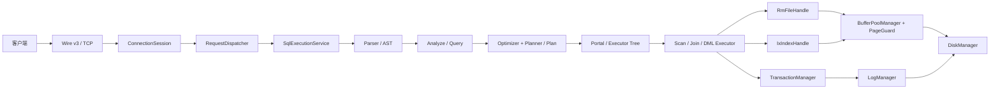
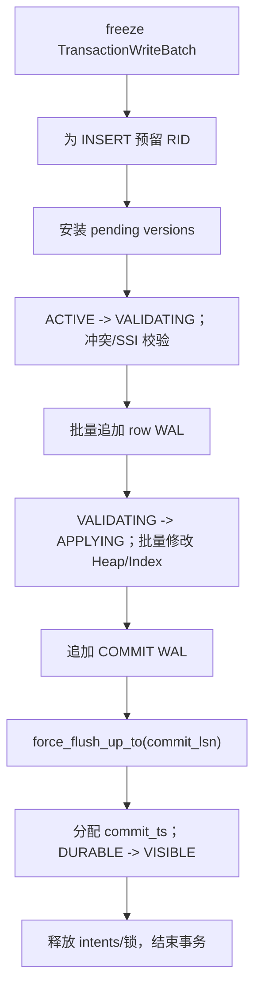
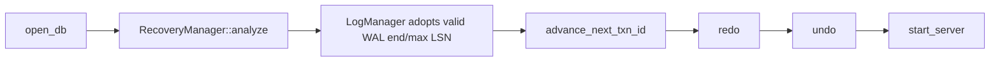

# 当前数据库核心架构与机制介绍

> 适用源码：`finals-wire-ssi` 工作树，提交 `44c52eb10ea25409a5f1cd669ef34231e81fc717`。
>
> 文档定位：团队内部技术消化材料。内容以当前源码为准，不把历史方案、注释中的旧描述或尚未运行验证的设想当成已实现事实。

## 1. 先建立整体认识

RMDB 当前是一个 C++17、页面式存储、B+Tree 索引、WAL 恢复，并同时支持锁式 `READ COMMITTED`、`SNAPSHOT ISOLATION`（SI）和基于读写依赖检测的 `SERIALIZABLE`（SSI）的数据库系统。

系统主链可以压缩为：



其中最重要的分层边界是：

| 层次 | 主要职责 | 关键入口 |
|---|---|---|
| 网络层 | 握手、帧解析、批请求、错误状态、结果编码 | `network/connection_session.cpp`、`network/request_dispatcher.cpp` |
| SQL 前端 | 解析、语义检查、参数类型、生成逻辑查询 | `parser/`、`Analyze::do_analyze()` |
| 优化与计划 | 谓词规范化、索引选择、连接顺序、生成物理计划 | `Optimizer::plan_query()`、`Planner` |
| 执行层 | 将计划变为算子树并拉取元组；执行 DML | `Portal`、`execution/executor_*.h` |
| 事务与并发 | 事务生命周期、RC 锁、SI/SSI、写冲突、提交发布 | `TransactionManager`、`LockManager` |
| 记录与索引 | Heap 页、RID、空闲页、B+Tree | `RmFileHandle`、`IxIndexHandle` |
| 缓冲与磁盘 | 页缓存、pin/unpin、页面锁、淘汰、文件 I/O | `BufferPoolManager`、`DiskManager` |
| 日志与恢复 | WAL、持久化水位、checkpoint、REDO/UNDO | `LogManager`、`RecoveryManager` |

---

## 2. Wire/SQL 到执行器、存储层的完整调用链

### 2.1 服务启动与连接

服务入口是 `src/rmdb.cpp::main()`：

1. 创建全局的 `DiskManager`、`BufferPoolManager`、`RmManager`、`IxManager`、`SmManager`、`LockManager`、`TransactionManager`、`Planner`、`Optimizer`、`QlManager`、`LogManager` 和 `RecoveryManager`。
2. `initialize_database()` 打开数据库，执行恢复的 `analyze() -> redo() -> undo()`。
3. `start_server()` 在 8765 端口监听；每个连接由一个分离的 pthread 执行 `client_handler()`。
4. 每个连接拥有自己的 `SqlExecutionService`、`ConnectionSession`、`RequestDispatcher` 和 prepared dictionary；底层存储、事务、日志对象由连接共享。

`ConnectionSession::run_with()` 先完成 Wire 握手，再循环读取固定长度帧头和 payload。帧交给 `RequestDispatcher::dispatch()`，支持三类入口：

- `EXEC_STREAM`：直接执行一条 SQL。
- `PREPARE_SET`：批量解析、检查、规划 SQL，原子安装 prepared dictionary。
- `EXEC_BATCH`：按 prepared statement id 和绑定参数执行一组操作。

批执行发生异常时，`RequestDispatcher` 会调用 `abort_if_active()`：

- 事务冲突映射为 `TRANSACTION_ABORT`；
- 普通 SQL/执行错误映射为 `ERROR`；
- 当前事务必须先完成回滚，才发送终态响应；
- AUTO_ABORT 下，批中已经执行的写操作不能残留。

### 2.2 SQL 前端

普通 SQL 的核心路径是：

```text
SqlExecutionService::execute_stream()
  -> build_plan()
     -> parse_sql()
        -> yy_scan_string() / yyparse()
        -> ast::parse_tree
     -> Analyze::do_analyze()
        -> Query
     -> Optimizer::plan_query()
        -> Planner::do_planner()
        -> Plan
  -> execute_plan()
```

各阶段职责：

1. Parser 将 SQL 转成 `ast::TreeNode`，语法来自 `parser/lex.l` 和 `parser/yacc.y`。
2. `Analyze` 校验表、列、类型、别名、条件、参数类型，把 AST 转成 `Query`。
3. `Optimizer::plan_query()` 先处理事务控制、DDL 等 utility 语句，其余交给 `Planner::do_planner()`。
4. `Planner::logical_optimization()` 当前会做谓词规范化与去重、等值常量传递、内连接重排。
5. `Planner::make_one_rel()` 和 `physical_optimization()` 选择顺序扫描/索引扫描、构造连接、排序、聚合、投影等计划。

Parser 和 Optimizer 分别受 `parser_mutex`、`optimizer_mutex` 保护。这保证了共享 parser 状态和计划阶段的线程安全，但也意味着并发连接的解析与优化阶段会串行化。

### 2.3 Plan 到 Executor

`SqlExecutionService::execute_plan()` 创建 `Context`，其中携带：

- `LockManager *lock_mgr_`；
- `LogManager *log_mgr_`；
- 当前 `Transaction *txn_`；
- `TransactionManager *txn_mgr_`；
- 会话隔离级别；
- typed `ResultSink`。

随后：

```text
Portal::start(plan, context)
  -> Portal::convert_plan_executor()
  -> 构造 Executor Tree
Portal::run()
  -> QlManager::select_from() / run_dml() / run_cmd_utility()
```

主要映射如下：

| Plan | Executor/执行入口 |
|---|---|
| `ScanPlan(T_SeqScan)` | `SeqScanExecutor` |
| `ScanPlan(T_IndexScan)` | `IndexScanExecutor` |
| `JoinPlan` | `NestedLoopJoinExecutor` |
| `FilterPlan` | 下推给 Scan，或创建 `FilterExecutor` |
| `ProjectionPlan` | `ProjectionExecutor` |
| `AggregatePlan` | `AggregationExecutor` |
| `SortPlan` | `SortExecutor` |
| `UnionPlan` | `UnionExecutor` |
| INSERT | `InsertExecutor` |
| UPDATE | 先扫描收集 RID，再创建 `UpdateExecutor` |
| DELETE | 先扫描收集 RID，再创建 `DeleteExecutor` |

查询执行采用迭代器模型：`beginTuple()` 初始化，`is_end()` 判断结束，`nextTuple()` 前进，`Next()` 返回当前元组。`QlManager::select_from()` 拉取每一行，将内部 `INT/FLOAT/CHAR` 转成 Wire 的 `INT32/FLOAT32/CHAR` 后写入 `ResultSink`。

### 2.4 Prepared 与批执行

`PREPARE_SET` 在准备期完成：

```text
decode_prepare_set()
  -> SqlExecutionService::prepare()
  -> build_plan(sql, parameter_types)
  -> infer_output_schema()
  -> PreparedDictionary::install_atomically()
```

`EXEC_BATCH` 不再重新解析 SQL，而是：

```text
decode_exec_batch()
  -> bind_plan_parameters()
  -> execute_prepared()
  -> execute_plan(cached_plan)
```

连续的 prepared INSERT 在显式事务中可进入 `execute_prepared_batch()`，一次构造 `BatchInsertExecutor`，减少重复执行开销。

---

## 3. 存储层：Disk、BufferPool、PageGuard、Record、B+Tree

### 3.1 DiskManager

`DiskManager` 是最底层文件接口，负责：

- 数据页：`read_page()`、`write_page()`、`allocate_page()`；
- 数据库目录和文件：create/open/close/destroy；
- WAL：`read_log()`、`write_log()`、`sync_log()`、`truncate_log()`；
- checkpoint 重启位置：`write_restart_offset()`、`read_restart_offset()`；
- 文件页号分配水位：`fd2pageno_`。

上层不应绕过 Buffer Pool 直接长期持有数据页；DiskManager 只认识文件描述符、页号和字节区间，不理解表、记录或事务语义。

### 3.2 Page 与 BufferPoolManager

页面大小固定为 4096 字节。`PageId = {fd, page_no}` 唯一标识一个磁盘页；Buffer Pool 中每个 `Page` 还维护 `pin_count_`、`is_dirty_` 和页数据。

当前服务端缓冲池并非永远固定 512 MiB：

- `BUFFER_POOL_SIZE = 131072` 页，是 512 MiB 的最低页数；
- `server_memory_budget.h` 根据物理内存的四分之一选择容量；
- 页面数据上限为 2 GiB，即 524288 页；
- `RMDB_BUFFER_POOL_PAGES` 可在合法范围内覆盖；
- 这只是页面数组大小，RSS 还包含 frame 控制块、MVCC 版本、索引元数据、线程栈等。

Buffer Pool 的核心结构：

| 结构 | 作用 |
|---|---|
| `pages_` | 连续的 frame 数组 |
| 64 个 `PageTableShard` | 分片维护 `PageId -> frame_id` |
| `free_list_` | 尚未使用的 frame |
| `LRUReplacer` | 只管理 pin count 为 0 的可淘汰 frame |
| `FrameControl` | frame 状态、代次、脏页 epoch、PageLSN、元数据锁、内容读写锁、I/O 条件变量 |

Frame 状态机为：

```text
FREE -> LOADING -> VALID -> EVICTING -> LOADING/FREE
```

`fetch_page()` 的关键步骤：

1. 在对应 page-table shard 中查找缓存命中。
2. 命中时锁 frame 元数据、增加 pin count，并从 replacer 移除。
3. 未命中时在 `victim_latch_` 下从 free list 或 LRU 预留 victim。
4. 以 shard 编号顺序锁新旧 page-table shard，替换映射并把 frame 置为 `LOADING`。
5. 释放映射锁后做磁盘 I/O；同页并发 miss 通过 `io_cv` 等待同一加载结果。
6. 如果旧页是脏页，先执行 `flush_wal_before_page_write(old_page_lsn)`，再写数据页。

Buffer Pool 的正确性核心不是“缓存命中率”，而是以下三组一致性：

- `page_table_shards_`、frame 内 `PageId`、frame 状态必须一致；
- pin count 为正的 frame 不能进入 LRU victim；
- 脏页写回前，WAL durable LSN 必须覆盖该页关联的 PageLSN。

### 3.3 PageGuard

`BasicPageGuard`、`ReadPageGuard`、`WritePageGuard` 是 move-only RAII 对象：

- Basic guard 拥有一次 pin；析构或 `drop()` 自动 unpin；
- Read guard 在 pin 基础上持有 `content_latch` 的共享锁；
- Write guard 持有独占锁，可 `mark_dirty()`、设置 PageLSN；
- guard 保存 frame generation，防止 frame 被复用后旧 guard 错误 unpin 新页面；
- 移动构造会转移所有权，避免 double-unpin。

因此正确使用模式是“获得 guard—访问页面—让 guard 离开作用域”，不要长期保存裸 `Page *`。

### 3.4 Record/Heap 文件

一张表对应一个 `RmFileHandle`。Heap 文件布局为：

- 第 0 页：`RmFileHdr`；
- 第 1 页开始：记录页；
- 每个记录页包含 `RmPageHdr + bitmap + 定长 slot 数组`；
- `Rid = {page_no, slot_no}` 定位记录。

`RmFileHdr` 保存定长记录大小、页数、每页记录数、空闲页链表头和 bitmap 大小。`RmPageHdr` 保存本页记录数和下一空闲页。

`RmFileHandle` 的关键路径：

- `get_record()`：读取物理 slot，再交给 `TransactionManager` 做可见性解析；
- `batch_get_records()`：一页只加一次读锁，批量复制记录，再按 MVCC shard 批量过滤；
- `read_next_page_batch()`：顺序扫描一个 Heap 页；
- `insert_record()`：从内存空闲页候选中找 slot，必要时分配新页；
- `reserve_insert_slots()`：MVCC commit 前预留 INSERT 的实际 RID；
- `apply_page_batch()`：先验证同页所有 before image，再一次修改该页；
- `update_record()`、`delete_record()`：直接更新 slot/bitmap；
- recovery 通过 `upsert_record_for_recovery()` 和 `delete_record_for_recovery()` 做幂等物理修复。

空闲页同时存在内存候选集合和持久化链表。普通 DML 增量维护候选集合；`flush_file_header()` 会重建并持久化空闲页链。

### 3.5 B+Tree 索引

索引元数据在 `IxFileHdr` 中，包括根页、首尾叶页、字段类型与长度、复合键总长度和阶数。每个 `IxPageHdr` 保存父页、键数量、叶子标记和双向叶链。

复合键比较由 `ix_compare()` 逐列执行，支持 `INT`、`FLOAT` 和定长 `STRING`。复合索引遵守最左连续前缀：只有从第一列开始形成连续约束，才能构造有效范围。

查询路径：

```text
IndexScanExecutor
  -> IxIndexHandle::lower_bound()/upper_bound() 或 get_value()
  -> find_leaf_read()
  -> 内部节点 internal_lookup()
  -> 叶节点 lower_bound()/leaf_lookup()
  -> IxScan 沿 next_leaf 扫描
  -> RID 分页批量回表
  -> RmFileHandle::batch_get_records()
  -> MVCC 可见性 + 最终 WHERE 条件复核
```

插入分两条路径：

1. `try_insert_leaf_optimistic()`：先读定位叶页，再获得该叶页写 guard；若 generation 和键范围仍有效且叶页安全，直接插入。
2. `insert_with_structural_path()`：需要分裂时使用 latch crabbing，从根到叶持有不安全祖先；执行 `split_leaf()`、`split_internal()`，必要时建立新根。

删除采用 lazy deletion：`delete_entry()` 只从叶页移除键，不做节点合并或重分配。它缩短写路径并降低结构锁冲突，但长期删除负载可能带来低填充率和更多空页。

批提交通过 `insert_entries_batch()` 或 `apply_sorted_batch()` 先按键排序，把落在同一叶页的 mutation 成组处理；同键时先 DELETE 后 INSERT，以支持键更新。

索引是候选 RID 访问路径，不是最终可见性来源。IndexScan 仍必须：

- 回表读取 Heap 记录；
- 执行 MVCC 版本解析；
- 重新计算全部 WHERE 条件；
- 加入当前事务 staged INSERT/UPDATE；
- 通过 `IndexVersionStore` 找回已被新事务从物理索引删除、但对旧快照仍应可见的旧键 RID。

---

## 4. 事务对象与生命周期

### 4.1 Transaction 保存什么

`Transaction` 的主要状态包括：

- `txn_id_`：事务唯一标识；
- `txn_mode_`：显式事务还是单语句隐式事务；
- `TransactionState`：`DEFAULT/GROWING/SHRINKING/COMMITTED/ABORTED`；
- `isolation_level_`；
- `prev_lsn_`：本事务最后一条 WAL 的 LSN；
- `write_set_`：物理写回滚记录，主要服务非 MVCC 和异常物理回滚；
- `TransactionWriteBatch`：SI/SSI 的逻辑 staged INSERT/UPDATE/DELETE；
- `lock_set_`：LockManager 已授予的表/行锁；
- `TxnControl`：可被版本记录共享的 MVCC 发布状态；
- `start_ts/read_ts/commit_ts`；
- record/unique intents。

`TransactionManager::txn_map` 保存活跃 `Transaction *`，且 `get_transaction()` 检查创建线程 id；同一连接的事务由该连接线程继续使用。`TxnRegistry` 保存可共享的 `TxnControl`，供版本记录在 `Transaction` 对象释放前后安全观察事务状态。

### 4.2 BEGIN

```text
SqlExecutionService::ensure_transaction()
  -> TransactionManager::begin()
     -> 分配 txn_id
     -> 创建 Transaction/TxnControl
     -> 注册 txn_map 和 TxnRegistry
     -> SI/SSI 捕获 snapshot timestamp
     -> 加入 checkpoint active_txns_
     -> 写 BEGIN WAL
     -> state = GROWING
```

每条 SQL 即使没有显式 `BEGIN`，也会获得一个隐式事务。显式 `BEGIN` 只是把 `txn_mode_` 置为 true，使多个语句共享同一事务。

SI 的 `ensure_snapshot_admission()` 在第一次实际数据访问前重新捕获 snapshot，而不是仅以 BEGIN 应答时刻为准。`RMDB_SI_MAX_ACTIVE` 默认 0，即 admission 限流关闭；显式配置后才对 SI 生效。

### 4.3 读路径

RC 读：

1. Scan 获取表 IS 锁和记录 S 锁；
2. 从 Heap 复制记录；
3. 立即释放该批记录的 S 锁；
4. 执行条件并返回。

因此当前 RC 是“短读锁 + 写锁持有到事务结束”的实现，不应描述成所有 S/X 锁都严格持有到提交的完整 strict 2PL。

SI/SSI 读：

1. 读取物理 slot；
2. 先检查本事务 `TransactionWriteBatch` overlay，实现 read-your-own-writes；
3. 在 `MvccStore` 对应 shard 中选 `commit_ts <= start_ts` 的最新 `VISIBLE` 版本；
4. pending 版本对其他事务不可见；
5. 记录不存在或可见版本为 delete tombstone 时返回空。

SSI 在 SI 读路径之上还调用 `register_table_read()` 和 `register_record_read()`，记录谓词读、点读及 rw 依赖。

### 4.4 写路径

RC 写是立即物理修改：

```text
Executor
  -> IX 表锁 + X 行锁
  -> 写 row WAL
  -> 写 WriteRecord 回滚信息
  -> 修改 Heap
  -> 修改相关 B+Tree
```

SI/SSI 写在语句阶段只做逻辑暂存：

```text
Executor
  -> 检查 record/unique intent
  -> prepare_insert/update/delete()
  -> 在 MvccStore 安装或合并本事务 pending version
  -> TransactionWriteBatch::stage_*()
  -> 不立刻修改物理 Heap/B+Tree
```

这种设计使未提交写只对本事务可见，其他事务仍读到旧版本；同时把 Heap、多个索引和 WAL 的实际修改集中到 commit 阶段。

### 4.5 COMMIT

非 MVCC（RC）提交：

1. 写 `CommitLogRecord`；
2. `force_flush_up_to(commit_lsn)`；
3. 释放全部逻辑锁；
4. 清理 write set；
5. 状态改为 `COMMITTED`。

SI/SSI 提交采用“准备—验证—物理应用—持久化—发布”顺序：



关键实现位于：

- `TransactionManager::commit_mvcc()`；
- `StorageCommitExecutor::prepare()/apply()/rollback()`；
- `TxnRegistry::publish_commit()`；
- `MvccStore::publish()`。

物理应用阶段有 `RMDB_PHASE2_MAX_ACTIVE` 并发上限，默认 16、最大 64，防止大量 writer 同时压垮 Buffer Pool 和磁盘路径。

### 4.6 ABORT

RC abort 按 `write_set_` 逆序调用 `SmManager::rollback()`，恢复 Heap 和索引，然后写 ABORT WAL、释放锁。

SI/SSI 在尚未进入物理 apply 时，只需：

- 丢弃 staged batch；
- 删除 pending versions；
- 释放 record/unique intents；
- 标记 `ABORTED`。

如果 MVCC 已经进入物理应用，`StorageCommitExecutor::rollback()` 必须逆序恢复物理状态。由于系统没有 CLR（Compensation Log Record），存在物理回滚时会先刷数据库状态，再持久化 ABORT WAL，避免恢复误以为一个未落盘的回滚已经完成。

连接断开、批执行失败和 `TransactionAbortException` 都会走 `abort_active_transaction()`，完成回滚后再清理事务对象。

---

## 5. MVCC 的实际实现

### 5.1 当前真正的主路径

当前 MVCC 主实现由以下五部分组成：

| 组件 | 作用 |
|---|---|
| `TransactionWriteBatch` | 保存事务内尚未物理应用的逻辑写和 read-your-own-writes overlay |
| `TxnControl/TxnRegistry` | 保存事务共享状态、时间戳、发布顺序和 intents |
| `MvccStore` | 按记录保存版本链、record owner、unique-key owner |
| `IndexVersionStore` | 保存物理索引中已删除的旧键到 RID 映射，服务旧快照 |
| `StorageCommitExecutor` | commit 时冻结写集、预留 RID、批量写 WAL/Heap/Index、失败回滚 |

`transaction.h` 中的 `UndoLink/UndoLog`、`transaction_manager.h` 中的 `VersionUndoLink/version_info_` 和 `Watermark running_txns_` 是早期框架残留；当前源码中没有形成主要读写调用链。学习和说明当前实现时，应以上表五个组件为准。

### 5.2 版本结构

`MvccStore::Version` 记录：

- `owner/owner_control`：创建该版本的事务；
- `commit_ts`：提交时间，pending 时为 `INVALID_TS`；
- `before_deleted + before`：物理应用前是否不存在，以及 before image；
- `deleted + data`：after image 是否为删除，以及 after image；
- `table_name`：异常回滚和物理一致性检查所需表名。

版本按 `RecordKey{file_id, Rid}` 放入 256 个 shard。每个 shard 自带 mutex，并保存：

- `record_versions`；
- `record_owners`；
- `unique_owners`；
- `gc_dirty_keys`。

### 5.3 可见性规则

对事务 T、记录 R：

1. 若 T 的 staged overlay 中删除了 R，R 不可见。
2. 若 overlay 中有 T 自己的 UPDATE/INSERT，直接返回 staged after image。
3. 否则在 R 的版本链中寻找 owner 状态为 `VISIBLE` 且 `commit_ts <= T.start_ts` 的最大 commit_ts。
4. 找不到版本时，未被版本化的物理记录按 ts=0 处理。
5. 其他事务的 `ACTIVE/VALIDATING/APPLYING/DURABLE` 版本均不可见；只有 release-store 发布为 `VISIBLE` 后才可读。

这里 `DURABLE` 和 `VISIBLE` 分开非常关键：COMMIT WAL 已落盘不代表并发读者可以看到一半发布的事务。`MvccStore::publish()` 在设置 commit_ts 后，先置 DURABLE，最后用 release store 置 VISIBLE。

### 5.4 快照时间戳与连续发布

`TxnRegistry` 有两个时钟：

- `allocated_commit_clock_`：已分配的最大 commit timestamp；
- `commit_clock_`：已经完整发布的最大连续前缀。

并发提交可以乱序完成，但 `complete_commit_ts()` 只把 `commit_clock_` 推进到没有缺口的连续位置。新事务的 `capture_snapshot_ts()` 读取 `commit_clock_`，因此不会捕获到“时间戳已分配但版本尚未发布”的半完成提交。

### 5.5 写冲突和唯一键冲突

SI/SSI 使用 fail-fast intent：

- `try_acquire_record_intent()` 保证同一记录同时只有一个未决 writer；
- `try_acquire_unique_intent()` 保证同一索引二进制键只有一个未决 writer；
- 已有 owner 若尚未 `VISIBLE/ABORTED`，新 writer 立即 `WRITE_CONFLICT`，不等待；
- 若版本链存在 `commit_ts > start_ts` 的已提交写，说明当前事务基于陈旧快照写入，同样 abort；
- commit 前还会校验物理 before image，防止 Heap 已被其他路径修改。

索引唯一性不能只查当前 B+Tree。键更新或删除会从物理索引移除旧键，但旧快照仍可能看到旧记录，因此 `IndexVersionStore::conflicts_with_snapshot()` 还会检查旧键历史。

### 5.6 SI 与 SSI

SI 解决写写冲突，但允许 write skew。SERIALIZABLE 在 SI 之上记录 rw-antidependency：

- point read 记录 `read_records`；
- scan 记录 `ReadPredicate{file_id, conditions, columns}`；
- writer 的 before/after image 命中已有读集合或谓词时，建立 `reader ->rw writer`；
- `dependency_forms_dangerous_structure()` 检测重叠事务中的 `Tin ->rw Pivot ->rw Tout`；
- 满足危险结构条件时，固定中止“当前语句所属事务”，立即抛 `SERIALIZATION_FAILURE`，而不是拖到 COMMIT。

SSI 元数据由 `serializable_state_latch_` 保护。SI 不进入该全局依赖图，因此 SI 热路径不承担谓词图维护成本。

### 5.7 版本回收

watermark 当前直接由 `TxnRegistry` 计算：

```text
watermark = min(当前连续 commit_ts, 所有未 VISIBLE/ABORTED 事务的 start_ts)
```

比 watermark 更旧、且不再可能被任何活跃快照读取的历史版本可以删除。`GarbageCollection()` 做完整扫描；commit 热路径每 256 次 MVCC commit 调用一次 `garbage_collect_incremental()`，每次只处理一个版本 shard。

如果某个 key 最终只剩一个已稳定版本且已早于 watermark，整个内存版本项都可以删除，让物理 Heap 重新成为权威状态。`IndexVersionStore` 中 `valid_until <= watermark` 的旧键映射也会回收。

---

## 6. RC、SI、SERIALIZABLE 的实际差异

| 维度 | READ COMMITTED | SNAPSHOT ISOLATION | SERIALIZABLE |
|---|---|---|---|
| 默认性 | 会话默认 | 通过 SET 切换 | 通过 SET 切换 |
| 主要并发机制 | LockManager | MVCC snapshot + fail-fast intents | SI + SSI 依赖图 |
| 读视图 | 每次读取当前已提交状态 | 固定 `start_ts` 快照 | 固定 `start_ts` 快照 |
| 读锁 | IS + S，读取后释放记录 S 锁 | 不使用记录 S 锁 | 不使用记录 S 锁 |
| 写锁 | IX + X，持有到提交/回滚 | 不走 LockManager 行 X 锁 | 不走 LockManager 行 X 锁 |
| 写入时机 | 语句阶段直接改 Heap/Index | 语句阶段 staged，commit 物理应用 | staged，commit 物理应用 |
| 写写冲突 | 锁等待，超时 abort | record/unique intent 立即 abort | 同 SI |
| 防止 write skew | 否 | 否 | 通过 rw dangerous structure 检测 |
| 额外元数据 | lock table、write set | 版本链、写批、索引历史 | SI 元数据 + predicate/read/dependency graph |

源码中的 `IsolationLevel` 还枚举了 `READ_UNCOMMITTED`、`REPEATABLE_READ`，但当前 Wire/SQL 会话切换只明确支持 Snapshot Isolation 和 Serializable，默认是 Read Committed。不要把枚举存在等同于完整隔离语义已实现。

---

## 7. LockManager 与内部 latch

### 7.1 Lock 与 latch 的区别

- LockManager 的表锁/行锁保护数据库逻辑对象，生命周期可跨多个函数甚至整个事务。
- mutex/shared_mutex 形式的 latch 保护内存数据结构，持有时间应短，不表达 SQL 隔离语义。

把二者混为一谈会导致错误结论。例如 SI 不获取行 X lock，但仍必须获取 MVCC shard latch、Heap page write latch 和 B+Tree page latch。

### 7.2 LockManager

LockManager 支持：

- 表级 IS、IX、S、X、SIX；
- 记录级 S、X；
- 全局 `lock_table_`，由单个 `latch_` 保护；
- 每个锁对象一个 request queue 和 condition variable；
- 同事务重复申请可复用已有更强锁；
- 锁升级在兼容后生效；
- 等待超过 5 秒抛 `DEADLOCK_PREVENTION`。

当前实现不是等待图死锁检测，而是“有限等待 + 超时中止”。队列兼容检查忽略尚未 granted 的申请，因此实现简单，但严格 FIFO 公平性和抗饥饿能力有限。

为降低多行写死锁，Update/Delete 在加 X 行锁前按 `(page_no, slot_no)` 排序。commit/abort 复制 `lock_set_` 后逐一 `unlock()`。

### 7.3 主要内部 latch

| 位置 | latch | 保护对象 |
|---|---|---|
| `rmdb.cpp` | `parser_mutex` | 非线程安全 parser 全局状态 |
| `rmdb.cpp` | `optimizer_mutex` | 共享 Planner/Optimizer |
| `LockManager` | `latch_` | 全局 lock table 和请求队列 |
| `BufferPoolManager` | 64 个 shard latch | page table 映射 |
| `BufferPoolManager` | `victim_latch_` | free-list/victim 预留 |
| `FrameControl` | `meta_latch` | frame 状态、pin、generation、dirty epoch |
| `FrameControl` | `content_latch` | 页内容 |
| `RmFileHandle` | `lifecycle_latch_` | DML 与文件头/空闲链持久化生命周期 |
| `RmFileHandle` | allocation/free/reservation latch | 页分配、空闲候选、预留 slot |
| `RmFileHandle` | `logical_update_latch_` | 非 MVCC 索引表的逻辑写串行化 |
| `IxIndexHandle` | `root_latch_` | root page id 的读取/替换 |
| `IxIndexHandle` | header/allocation latch | 索引头和新页分配 |
| B+Tree/Heap | PageGuard content latch | 单页读写 |
| `MvccStore` | 256 个 shard latch | 版本、record owner、unique owner |
| `TxnRegistry` | registry shared latch | TxnControl 注册表 |
| `TxnRegistry` | publication latch | 连续 commit timestamp 发布 |
| `TransactionManager` | `serializable_state_latch_` | SSI 读写依赖图 |
| `LogManager` | `latch_` | WAL buffer、LSN、水位、group commit |

### 7.4 当前锁序与规避策略

源码没有一张统一的全局锁序表，但关键路径使用以下规则避免环：

1. 多个 Buffer page-table shard 按 shard 编号从小到大加锁。
2. MVCC commit 校验先收集涉及的 shard 编号，再按排序结果加锁。
3. 多行 LockManager X 锁按 RID 排序申请。
4. Heap commit work 按 `(fd, page_no)` 排序，Index work 按 index fd 排序。
5. B+Tree 安全子节点允许释放祖先；结构修改保留不安全祖先。
6. 叶链页号可能非单调，代码检测反向页号关系并释放/重试，避免持有大页号再等待小页号。
7. `std::scoped_lock` 用于 allocation/reservation 等多 mutex 同时获取。

仍需警惕的死锁/阻塞点：

- 不要持有 MVCC shard latch 再进入可能反向获取同 shard 的复杂流程；
- 不要在持有 PageGuard 时调用会重新获取同页独占 guard 的函数；
- B+Tree 分裂时必须保持父子和相邻叶链更新的一致锁序；
- checkpoint 会等待全部 active statement/transaction 退出，是有意的全局静默点；
- LockManager 超时只能打破等待，不能提供真正的等待图诊断。

---

## 8. WAL、PageLSN、Checkpoint 和崩溃恢复

### 8.1 WAL 结构

支持的日志类型：

- BEGIN；
- INSERT：after image、RID、表名；
- DELETE：before image、RID、表名；
- UPDATE：before image、after image、RID、表名；
- COMMIT；
- ABORT；
- CHECKPOINT：活跃事务列表。

公共日志头包含 `log_type, lsn, total_len, txn_id, prev_lsn`。`prev_lsn` 把同一事务日志串成链，但当前恢复 loser UNDO 实际使用扫描得到的 action offset 逆序处理，而不是完整 ARIES 的 CLR/undo-next-LSN 体系。

### 8.2 LogManager 和 group commit

`LogManager` 维护：

- `global_lsn_`：下一 LSN；
- `written_lsn_`：已写入 WAL 文件、但不一定 fsync 的最大 LSN；
- `durable_lsn_`：已被 fsync 覆盖的最大 LSN；
- 单个 `LogBuffer` 和保护它的 mutex。

`force_flush_up_to(target_lsn)` 保证返回时 `durable_lsn >= target_lsn`。首个 waiter 成为 group commit leader，默认等待 1000 微秒（可用 `RMDB_GROUP_COMMIT_US` 在 0～5000 微秒内覆盖），让其他事务把 COMMIT 日志追加到同一批，再做一次 write + fsync。其他 waiter 等待 durable watermark 覆盖自己的 LSN。

### 8.3 WAL-before-data 与 PageLSN

写 Heap 页时，`RmPageWriteHandle::set_page_lsn()` 同时把 LSN 写入页头区域并传给 guard；索引页通过 guard/frame 控制信息关联 LSN。Buffer Pool 在脏页淘汰或主动刷页前调用：

```text
LogManager::force_flush_up_to(page_lsn)
  -> durable_lsn >= page_lsn
  -> DiskManager::write_page()
```

因此本系统中 PageLSN 的主要作用是建立 WAL-before-data 刷写屏障。当前 recovery 不依赖“比较磁盘 PageLSN 后跳过 REDO”的 ARIES 优化，而是通过幂等 `upsert/delete` 重放。

### 8.4 提交持久化顺序

正确顺序必须是：

```text
row WAL 已追加
  -> Heap/Index 物理变更可进入 Buffer Pool
  -> COMMIT WAL 已追加并 fsync
  -> durable_lsn 覆盖本事务 COMMIT
  -> MVCC 版本发布为 VISIBLE
  -> 返回成功响应
```

不能把 VISIBLE 提前到 fsync 之前，否则其他事务可能读到一个崩溃后不存在的提交；也不能在 COMMIT ACK 后才异步保证本事务 WAL 持久化。

### 8.5 Static checkpoint

`QlManager::create_static_checkpoint_internal()`：

1. `begin_static_checkpoint()` 阻止新语句进入，并等待 `active_statements_ == 0 && active_txns_.empty()`。
2. 清理仍可能遗留的已提交 MVCC delete tombstone 物理状态。
3. 写并 fsync CHECKPOINT WAL，得到 checkpoint offset。
4. `SmManager::flush_for_checkpoint()` 刷元数据、Heap/Index 和脏页。
5. 为索引创建 checkpoint snapshot。
6. 原子写入 restart offset。
7. 清理旧索引快照并解除全局静默。

`PREPARE_SET` 前如果没有可用 checkpoint，`SqlExecutionService::prepare()` 会调用 `ensure_prepared_checkpoint()` 建立通用持久化基线。

### 8.6 重启恢复

服务启动严格按：



`analyze()`：

- 验证 restart offset 是否指向有效且无活跃事务的 CHECKPOINT；
- 扫描完整有效日志前缀，丢弃尾部破损记录；
- 识别 committed、aborted 和仍 active 的 loser；
- 决定能否恢复 checkpoint 索引快照；否则登记需要重建索引的表。

`redo()`：

- committed/winner 的 INSERT/DELETE/UPDATE 执行幂等重放；
- 已有 ABORT 的事务不重放原动作；
- 最终仍 active 的 loser 只记录日志 offset，不物理 REDO，避免在 UNDO 前与 committed winner 发生唯一键冲突。

`undo()`：

- 按 loser action offset 逆序执行反操作；
- INSERT -> remove，DELETE -> install before image，UPDATE -> install old image；
- 完成物理恢复后才为 loser 写 ABORT WAL 并 fsync；
- 没有索引快照时重建受影响索引；
- 有 checkpoint 时只做必要的增量 Heap/free-list 修复；
- `flush_touched_for_recovery()` 只刷 touched 表和必要元数据，缩短 readiness 临界路径。

---

## 9. 关键操作的源码调用链

### 9.1 SELECT

```text
ConnectionSession::run()
  -> RequestDispatcher::dispatch_stream()/dispatch_batch()
  -> SqlExecutionService::build_plan()
  -> Parser -> Analyze -> Optimizer -> Planner
  -> Portal::start()
  -> SeqScanExecutor 或 IndexScanExecutor
     -> RmFileHandle::read_next_page_batch()/batch_get_records()
     -> BufferPoolManager::fetch_page_read()
     -> TransactionManager::filter_visible_records()
     -> SSI register_table_read()/register_record_read()
  -> Filter/Join/Aggregation/Projection
  -> QlManager::select_from()
  -> ResultSink -> Wire response
```

### 9.2 INSERT

RC：

```text
InsertExecutor::Next()
  -> 唯一索引 get_value()
  -> RmFileHandle::insert_record()
     -> row WAL -> Heap slot/bitmap/PageLSN
  -> Transaction::append_write_record()
  -> IxIndexHandle::insert_entry()
```

SI/SSI：

```text
InsertExecutor::Next()
  -> 物理索引 + IndexVersionStore + staged batch 唯一性检查
  -> check_insert_conflict()（SSI 谓词冲突）
  -> TransactionWriteBatch::stage_insert()
  -> COMMIT 时 reserve RID -> prepare_insert -> WAL/Heap/Index batch apply
```

### 9.3 UPDATE

```text
Portal::start()
  -> ScanExecutor 收集目标 RID
  -> UpdateExecutor::Next()
     -> 读取当前可见记录
     -> 按列类型计算 after image（FLOAT 在每次赋值边界保持 binary32）
     -> 只为被 SET 列影响的索引构造旧/新键
```

RC 随后直接写 UPDATE WAL、保存 old image、更新 Heap，并只在键实际变化时 delete old key/insert new key。

SI/SSI 调用 `prepare_update()` 安装 pending version，再 `stage_update()`；commit 时 `apply_page_batch()` 验证 before image，键不变的索引不会产生 delete/insert churn。

### 9.4 COMMIT

```text
COMMIT Plan
  -> QlManager::run_cmd_utility()
  -> TransactionManager::commit()
     -> RC: COMMIT WAL + force flush
     -> SI/SSI: commit_mvcc()
        -> StorageCommitExecutor::prepare()
        -> conflict/SSI validation
        -> add_logs_to_buffer(row logs)
        -> Heap page batches
        -> B+Tree mutation batches
        -> COMMIT WAL + force_flush_up_to()
        -> TxnRegistry::publish_commit()
        -> MvccStore::publish(VISIBLE)
     -> unlock/cleanup/finish_transaction
  -> ResultSink::command_ok()
```

### 9.5 重启恢复

```text
rmdb main
  -> SmManager::open_db()
  -> RecoveryManager::analyze()
  -> LogManager::initialize_from_recovery_scan()
  -> RecoveryManager::redo()
  -> RecoveryManager::undo()
  -> SmManager::flush_touched_for_recovery()
  -> QlManager::set_checkpoint_available()
  -> create_listener()/accept()
```

监听端口只在恢复结束后建立，因此恢复阶段的全表扫描、全索引重建或不必要刷盘会直接体现为 post-recovery readiness 延迟。

---

## 10. 正确性不变量、性能瓶颈和设计取舍

### 10.1 必须保持的正确性不变量

1. **WAL-before-data**：脏页写磁盘前，WAL 必须 durable 到该页 LSN。
2. **Durable-before-visible**：MVCC 提交先持久化 COMMIT，再发布 VISIBLE。
3. **Durable-before-ACK**：成功应答前，本事务 COMMIT LSN 已被 durable watermark 覆盖。
4. **快照无缺口**：snapshot timestamp 只能取完整发布的连续 commit 前缀。
5. **本事务读己之写**：staged overlay 优先于物理页和公共版本链。
6. **陈旧 writer 必须 abort**：不能把基于旧快照的相对 UPDATE 应用到更新后的物理记录。
7. **唯一键跨物理索引与历史都唯一**：检查当前 B+Tree、pending unique intent 和旧键历史。
8. **索引只是候选路径**：回表后重新做可见性和全部谓词判断。
9. **Heap 元数据一致**：bitmap、`num_records`、free candidate、持久化 free-list 必须同步。
10. **Buffer frame 身份一致**：PageId、page table、state、generation、pin count 必须匹配。
11. **B+Tree 结构一致**：父子指针、separator、首尾叶和双向叶链必须同步更新。
12. **恢复幂等**：重复 REDO/UNDO 不得制造重复索引键或复活 loser 数据。
13. **AUTO_ABORT 原子性**：批操作失败后，先前操作必须回滚，不能返回 ERROR 后留有写入。
14. **Checkpoint 顺序**：只有基线数据/索引完成刷写后，restart offset 才能指向该 checkpoint。

### 10.2 主要性能瓶颈

| 热点 | 原因 | 当前缓解方式 |
|---|---|---|
| Parser/Optimizer 全局 mutex | 共享前端状态 | prepared plan 避免测量期重复解析规划 |
| WAL mutex + fsync | 所有 writer 汇聚 | row WAL 批量追加、group commit |
| 热记录/唯一键 | SI fail-fast 冲突造成 abort/retry | 分片 owner 表、快速失败，避免长等待 |
| LockManager 全局 latch | RC 所有逻辑锁共用 | 短读锁、RID 排序；仍是扩展性上限 |
| B+Tree 热叶/分裂 | 同一键范围争用页面写锁 | optimistic leaf insert、latch crabbing、同叶批处理 |
| Buffer victim 路径 | free-list/LRU 和映射替换 | 64 个 page-table shard，I/O 不长期占映射锁 |
| Heap 热页 | 同一 page content latch | page batch，一次 guard 应用多个 slot mutation |
| SSI 元数据 | 谓词注册可能扫描 256 个版本 shard | 完全隔离在 SERIALIZABLE 路径 |
| checkpoint | 等待全部事务并刷写基线 | prepared 前建立一次静态基线；恢复使用索引快照 |
| MVCC 内存 | 每版本保存 before/after 和 TxnControl | watermark GC、每 256 commit 增量处理一个 shard |

### 10.3 关键设计取舍

- **SI 冲突立即 abort，而不是等待**：降低锁等待和死锁复杂度，但热点下 abort rate 可能升高。
- **MVCC 写延迟到 commit**：获得事务私有写和集中原子应用，但 commit 路径更重，需要物理失败回滚。
- **版本在内存、Heap 保存最新物理状态**：不改变磁盘 Heap 格式和恢复格式，但重启后不保留旧快照；这在重启时无活跃事务的前提下成立。
- **IndexVersionStore 只保留旧键映射**：避免改造磁盘 B+Tree 为多版本索引，但需要额外内存和 GC。
- **B+Tree lazy delete**：写路径短、并发简单，但可能积累低利用率叶页。
- **Buffer Pool 分片映射 + per-frame latch**：不同页并发度高，但状态机和 generation 校验更复杂。
- **静态 checkpoint**：恢复逻辑清晰、启动快，但 checkpoint 创建时会停止新工作并等待所有事务退出。
- **恢复不用 CLR**：实现简单，但物理 rollback 必须在 ABORT durable 前持久化，异常路径成本较高。

---

## 11. 关键源码索引

### 11.1 类与函数

| 主题 | 文件 | 关键符号 |
|---|---|---|
| 服务启动/恢复/监听 | `src/rmdb.cpp` | `initialize_database()`、`client_handler()`、`start_server()` |
| Wire 会话 | `src/network/connection_session.cpp` | `ConnectionSession::run_with()` |
| Wire 分发和 AUTO_ABORT | `src/network/request_dispatcher.cpp` | `dispatch()`、`dispatch_batch()`、`abort_if_active()` |
| SQL 总入口 | `src/execution/sql_execution_service.cpp` | `build_plan()`、`execute_plan()`、`execute_prepared()` |
| 语义分析 | `src/analyze/analyze.cpp` | `Analyze::do_analyze()` |
| 逻辑/物理规划 | `src/optimizer/planner.cpp` | `logical_optimization()`、`make_one_rel()`、`generate_select_plan()` |
| Plan 转算子 | `src/portal.h` | `Portal::start()`、`convert_plan_executor()`、`run()` |
| 查询结果 | `src/execution/execution_manager.cpp` | `QlManager::select_from()` |
| 顺序/索引扫描 | `src/execution/executor_seq_scan.h`、`executor_index_scan.h` | `beginTuple()`、批量回表、可见性过滤 |
| DML | `src/execution/executor_insert.h`、`src/execution/executor_update.h`、`src/execution/executor_delete.h` | `Next()` |
| 事务对象 | `src/transaction/transaction.h` | `Transaction`、`TxnControl`、write batch/lock set |
| 事务生命周期 | `src/transaction/transaction_manager.cpp` | `begin()`、`commit()`、`abort()`、`commit_mvcc()` |
| MVCC 读写 | 同上 | `get_visible_record()`、`filter_visible_records()`、`prepare_write_internal()` |
| SSI | 同上 | `register_table_read()`、`register_record_read()`、`dependency_forms_dangerous_structure()` |
| MVCC 版本 | `src/transaction/mvcc_store.*` | `try_acquire_*_intent()`、`publish()`、`abort()` |
| 时间戳发布 | `src/transaction/txn_registry.*` | `capture_snapshot_ts()`、`publish_commit()`、`complete_commit_ts()` |
| staged 写 | `src/transaction/transaction_write_batch.*` | `stage_*()`、`lookup()`、`freeze()`、`discard()` |
| commit 物理应用 | `src/transaction/storage_commit_executor.*` | `prepare()`、`apply()`、`rollback()` |
| 旧索引版本 | `src/transaction/index_version_store.*` | `retain()`、`snapshot()`、`finalize()`、`garbage_collect()` |
| 逻辑锁 | `src/transaction/concurrency/lock_manager.*` | `lock()`、`compatible()`、`unlock()` |
| Heap | `src/record/rm_file_handle.*` | `get_record()`、`apply_page_batch()`、free-list 方法 |
| B+Tree | `src/index/ix_index_handle.*` | `find_leaf_read()`、`insert_entry()`、`split_leaf()`、`apply_sorted_batch()` |
| Buffer Pool | `src/storage/buffer_pool_manager.*` | `fetch_page()`、`flush_page()`、`unpin_guard()` |
| PageGuard | `src/storage/page_guard.*` | `BasicPageGuard`、`ReadPageGuard`、`WritePageGuard` |
| WAL | `src/recovery/log_manager.*` | `add_logs_to_buffer()`、`force_flush_up_to()` |
| 恢复 | `src/recovery/log_recovery.*` | `analyze()`、`redo()`、`undo()`、`finish_recovery()` |
| Checkpoint | `src/execution/execution_manager.cpp` | `create_static_checkpoint_internal()` |

### 11.2 关键测试

| 机制 | 测试文件 | 主要验证点 |
|---|---|---|
| MVCC durable-before-visible | `src/test/mvcc_commit_visibility_test.cpp` | WAL durable 前不可见、连续 timestamp 发布、record/unique intent 快速冲突 |
| MVCC fail-fast/SSI | `src/test/mvcc_fail_fast_test.cpp` | 记录/唯一键冲突时延、pending before image、危险结构 |
| MVCC 分片并发 | `src/test/mvcc_disjoint_progress_test.cpp` | 不同 shard 不被单 owner 全局阻塞 |
| MVCC GC | `src/test/mvcc_gc_reclamation_test.cpp` | 稳定版本回收、老快照边界保留 |
| staged write | `src/test/staged_write_visibility_test.cpp` | 提交前私有、commit 后可见、索引删除窗口 |
| 事务写批 | `src/test/transaction_write_batch_test.cpp` | overlay 合并、freeze、discard |
| commit 批处理 | `src/test/storage_commit_batch_test.cpp` | RID 预留、同页物理批应用 |
| 提交故障点 | `src/test/commit_failure_injection_test.cpp` | Heap/Index/WAL/发布各阶段崩溃边界 |
| abort 快路径 | `src/test/abort_without_checkpoint_test.cpp` | 未物理 apply 的 abort 不做全库 checkpoint/fsync |
| PageGuard | `src/test/page_guard_test.cpp` | move、自动 unpin、读写互斥、dirty 传播 |
| Buffer 并发 | `src/test/buffer_pool_concurrency_test.cpp` | 同页 miss 合并、跨 shard 命中、flush/dirty 竞态 |
| WAL-before-page | `src/test/wal_page_lsn_test.cpp` | 页写前日志持久化 |
| Group commit | `src/test/group_commit_test.cpp` | 多事务共享 fsync 且各自 durable |
| WAL 尾部扫描 | `src/test/log_record_scanner_test.cpp` | 有效日志前缀和损坏尾部处理 |
| B+Tree 并发 | `src/test/ix_concurrency_test.cpp` | 并发插入、查询、唯一性 |
| B+Tree 分裂/叶链 | `src/test/ix_disjoint_split_test.cpp` | 分裂、非单调叶链、同叶批处理、锁顺序 |
| Wire 批原子性 | `src/test/auto_abort_storage_batch_test.cpp` | AUTO_ABORT 后无前序写残留 |
| Wire/Prepared | `src/test/request_dispatcher_test.cpp`、`src/test/prepared_dictionary_test.cpp`、`src/test/parameter_binding_test.cpp` | 批状态、原子 prepare、类型绑定 |

阅读建议：先按第 2 节理解一条 SQL 如何走完整系统，再按第 9 节跟踪 SELECT/UPDATE/COMMIT；最后结合第 11.2 节测试，把每条正确性不变量和一个可执行证据对应起来。
