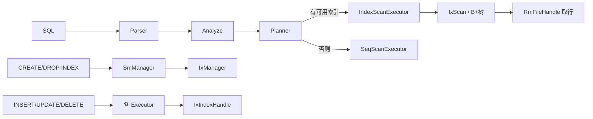

# 第三题题解：唯一索引功能

## 一、题目要求摘要

在第二题（DDL/DML/DQL）基础上，增加**唯一 B+ 树索引**，需满足：

| 能力 | 说明 |
|------|------|
| DDL | 单字段 / 多字段索引的创建、删除；`SHOW INDEX FROM` 展示 |
| 查询 | 单点查询、范围查询；**最左前缀**匹配（条件顺序可乱） |
| 维护 | INSERT / UPDATE / DELETE 时索引与基表同步 |
| 约束 | 唯一索引下键值不可重复 |
| 性能 | 测点 2、3 要求建索引后查询耗时 &lt; 无索引时的 70% |

输出格式：`SHOW INDEX` 为 `| table_name | unique | (col1,col2) |`；查询结果**列顺序**须一致，**行顺序**可不同。

---

## 二、总体思路

借鉴 **RMDB2025** 的成熟实现，在 db2026 上补齐三块能力：

1. **存储层**：完整 B+ 树（`ix_index_handle.cpp`）
2. **系统层**：索引 DDL + 元数据持久化（`sm_manager`）
3. **执行 / 优化层**：最左前缀选索引 + `IndexScanExecutor` + DML 维护索引



---

## 三、主要改动清单

### 3.1 B+ 树索引（`src/index/`）

| 文件 | 改动 |
|------|------|
| `ix_index_handle.cpp` | 自 RMDB2025 移植完整实现（约 945 行），含查找、插入、删除、分裂、合并、上下界 |
| `ix_index_handle.h` | 补充 `split_internal`、`redistribute_internal`、`coalesce_internal`、`get_rids` 声明 |

核心接口：

- `insert_entry` / `delete_entry` / `get_value`
- `lower_bound` / `upper_bound` → 供 `IxScan` 做范围遍历

### 3.2 系统管理器（`src/system/`）

**`SmManager::create_index`**

1. 检查索引是否已存在（`IndexExistsError`）
2. `ix_manager_->create_index` 创建 `.idx` 文件并打开句柄
3. 写入 `TabMeta.indexes`，`flush_meta` 持久化
4. `RmScan` 全表扫描，构造键值回填 B+ 树；若 `get_value` 已存在则回滚并报 `Index duplicate key error`

**`SmManager::drop_index`**

1. 从元数据删除索引项，`close_index` + `destroy_index`
2. 从 `ihs_` 移除句柄，`flush_meta`

**`SmManager::show_index`**

按题目格式打印三列：`table_name`、`unique`、`(col1,col2)`。

**`TabMeta::get_index_meta`（`sm_meta.h`）**

原逻辑仅**精确匹配**索引列名列表；改为**最左前缀匹配**：

- 查询列集合须包含索引第一列
- 在候选索引中选「连续前缀匹配长度」最长者
- 供 `IndexScanExecutor` 在 planner 传入完整索引列名时解析 `IndexMeta`

**`open_db`（已有）**

打开库时为每张表的所有索引调用 `ix_manager_->open_index` 填入 `ihs_`。

### 3.3 解析与计划（`src/parser/`、`src/optimizer/`）

| 改动 | 说明 |
|------|------|
| `ast.h` | 新增 `ShowIndex` AST 节点 |
| `yacc.y` | `SHOW INDEX FROM tbName` |
| `plan.h` | 新增 `T_ShowIndex` |
| `optimizer.h` | `ShowIndex` → `OtherPlan(T_ShowIndex, tab_name)` |
| `execution_manager.cpp` | `T_ShowIndex` 分支调用 `show_index` |

**`Planner::get_index_cols`（关键）**

原规则：WHERE 中所有 `col = val` 的列名拼起来，且须与某索引**完全一致**才走索引。

新规则（最左前缀）：

1. 收集该表上 `is_rhs_val` 且 `op != NE` 的条件列
2. 对每个索引，从左到右统计**连续**出现在条件中的列数
3. 选匹配列数最多的索引，将**该索引的全部列名**写入 `index_col_names`（非仅前缀）
4. 生成 `T_IndexScan` 计划

示例：索引 `(id, name, score)`，条件 `name='x' AND id=1` 仍可使用该索引（planner 侧条件顺序由 analyze 保留，扫描时按索引列序建键）。

### 3.4 索引扫描执行器（`executor_index_scan.h`）

实现 `beginTuple` / `nextTuple` / `Next`：

1. 用完整索引名打开 `IxIndexHandle`
2. `build_lower_key` / `build_upper_key`：对复合索引做**前缀等值 + 首列范围**裁剪
   - 连续前缀列：优先用 `OP_EQ`
   - 第一个无等值的列：取最优 `>`/`>=` 或 `<`/`<=` 作为下界/上界
   - 后续列填 min/max，后缀条件留给 `eval_conditions` 过滤
3. `ih->lower_bound` / `upper_bound` 构造 `IxScan`
4. 逐 RID `get_record`，`eval_conditions` 校验全部 WHERE（含 `OP_NE`、`OP_LT`/`OP_GT` 的严格性）

**与 RMDB2025 差异**：未采用批量 `batch_get_records`，实现更简单；对测点 2 的耗时仍依赖 B+ 树范围扫描而非全表顺序扫。

### 3.5 DML 索引维护（`executor_*.h`）

| 执行器 | 行为 |
|--------|------|
| `InsertExecutor` | 插行前对各索引 `get_value`；已存在则 `failure`；再 `insert_entry` |
| `UpdateExecutor` | 用新记录检查唯一性；对每个索引 `delete_entry` 旧键 + `insert_entry` 新键；最后 `update_record` |
| `DeleteExecutor` | 删行前按各索引列拼 key，`delete_entry`；再 `delete_record` |

---

## 四、关键算法说明

### 4.1 复合索引范围键（示意）

索引 `(w_id, name)`，条件 `w_id < 600 AND name > 'bztyhnmj'`：

- **下界**：`w_id = min_int`，`name = min_char`（`w_id` 无等值/下界，第一列用 min 并停止范围下推）
- **上界**：`w_id` 用 `< 600` 对应上界，`name = max_char`
- 扫描结果再用 `eval_conditions` 过滤 `name > 'bztyhnmj'`

条件 `w_id = 100 AND name = 'qwerghjk'`：

- 上下界均为 `(100, 'qwerghjk')`，等价点查。

### 4.2 唯一性保证时机

| 场景 | 检查点 |
|------|--------|
| `CREATE INDEX` 回填 | 插入前 `get_value`，重复则回滚索引文件 |
| `INSERT` | `insert_entry` 前 `get_value` |
| `UPDATE` | 写回前对新键 `get_value`，排除自身 RID |

---

## 五、涉及文件一览

```
src/index/ix_index_handle.cpp      # B+ 树（自 RMDB2025）
src/index/ix_index_handle.h        # 内部分裂/合并声明
src/system/sm_manager.cpp          # create/drop/show index
src/system/sm_manager.h
src/system/sm_meta.h               # get_index_meta 前缀匹配
src/optimizer/planner.cpp          # get_index_cols
src/optimizer/plan.h               # T_ShowIndex
src/optimizer/optimizer.h
src/parser/ast.h                   # ShowIndex
src/parser/yacc.y
src/execution/executor_index_scan.h
src/execution/executor_insert.h
src/execution/executor_update.h
src/execution/executor_delete.h
src/execution/execution_manager.cpp
build/run_task3_test.py            # 本地集成测试脚本
```

---

## 六、本地测试

### 6.1 编译

```bash
cd /root/db2026/build
cmake ..
make -j$(nproc)
```

### 6.2 单元测试（第一题模块）

```bash
./bin/unit_test
# 期望：5/5 PASSED
```

### 6.3 第三题集成测试

```bash
python3 run_task3_test.py
# 期望：Passed 3/3
#   - 1 show index
#   - 2 index query（单点、范围、单/复合索引）
#   - 3 index maintenance（INSERT/UPDATE 后查询）
```

启动服务端（评测 / 手动）：

```bash
./bin/rmdb <数据库名>
# 默认端口 8765
```

### 6.4 与 `第三题.md` 示例对照

**测点 1 — 索引 DDL**

```sql
create table warehouse (id int, name char(8));
create index warehouse (id);
show index from warehouse;
create index warehouse (id,name);
show index from warehouse;
drop index warehouse (id);
drop index warehouse (id,name);
show index from warehouse;
```

**测点 2 — 索引查询**（节选）

```sql
create index warehouse(w_id);
select * from warehouse where w_id = 10;
select * from warehouse where w_id < 534 and w_id > 100;
create index warehouse(w_id,name);
select * from warehouse where w_id = 100 and name = 'qwerghjk';
```

**测点 3 — 索引维护**（节选）

```sql
create index warehouse(w_id);
insert into warehouse values (500, 'lastdanc');
update warehouse set w_id = 507 where w_id = 534;
select * from warehouse where w_id < 534 and w_id > 100;
```

---

## 七、注意事项与可改进点

1. **测试库目录**：重复跑集成测试前需删除旧库目录，否则 `open_db` 可能因元数据与 `.idx` 文件不一致报错（`File not found: xxx.idx`）。`run_task3_test.py` 已在每次测试前 `shutil.rmtree` 对应库目录。

2. **性能测点**：平台用大批量查询对比有无索引耗时。当前实现通过 `IndexScan` + B+ 树范围定位满足「真正走索引」；若需进一步优化，可参考 RMDB2025 的批量取页（`batch_get_records`）。

3. **字符串键**：`build_*_key` 使用 `Condition.rhs_val.str_val`；analyze 阶段已对条件调用 `init_raw`，与定长 `CHAR(n)` 存储一致。

4. **事务 / 日志**：索引维护未单独写索引 WAL，与框架第二题一致，依赖单语句自动提交。

---

## 八、与 RMDB2025 的对应关系

| db2026 模块 | RMDB2025 参考 |
|-------------|----------------|
| `ix_index_handle.cpp` | 完整移植 |
| `sm_manager` 索引 DDL | `create_index` / `drop_index` / `show_index` |
| `get_index_meta` | 前缀匹配选索引 |
| `get_index_cols` | 最左前缀 + 返回完整索引列 |
| `IndexScanExecutor` | 简化版（无 batch 扫描） |
| DML 维护 | `executor_insert/update/delete.h` 同思路 |

---

## 九、提交建议

```bash
git add src/index/ src/system/ src/optimizer/ src/parser/ src/execution/ build/run_task3_test.py 第三题题解.md
git commit -m "实现第三题唯一索引：B+树、DDL、最左前缀 IndexScan、DML 维护"
```

推送到评测分支（如 `yan`）后，在平台选择对应题目提交。
